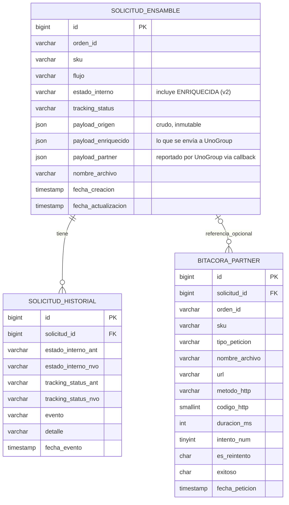

@
# Diseño — Módulo de Integración de Servicios de Ensamble

**Proyecto:** HUENSA-001 — Integración de Pedidos que Requieren Ensamble
**Documento:** principios, arquitectura conceptual, contrato
público (OpenAPI), hallazgos, preguntas de negocio, casos de uso y mapeo de campos.
**Diagrama de referencia:** `ArquitecturaDiagramaEnsambles.png` *(⚠ pendiente de actualizar — el diagrama actual muestra un solo módulo; ver nueva arquitectura de dos microservicios en §2)*

**Historial de revisiones:**
| Versión | Cambio principal |
|---|---|
| v1 | Diseño original — un solo módulo, 3 capas internas |
| v2 | **El módulo se separa en dos microservicios independientes** (Orquestador + Comunicación con UnoGroup), comunicados vía notificación asíncrona con callback (`unogroup-app` sin base de datos propia — ver §2.4). Mecanismo de entrada unificado (un solo tópico Pub/Sub para WMS y Guías Manuales). Nuevo hallazgo confirmado sobre el contrato real de Solution One (`mkdir_parents`). Actualización de stack: Java 21, Spring Boot 4.x, OpenFeign. |
| **v2.1 (este documento)** | **Nomenclatura de tablas actualizada por schema físico compartido:** la instancia/schema de Cloud SQL se comparte con otros sistemas de Siman (no solo con `unogroup-app`). Las tres tablas del módulo adoptan el prefijo `ensamble_` para evitar colisiones de nombre — `solicitud_ensamble` → `ensamble_solicitud`, `solicitud_historial` → `ensamble_solicitud_historial`, `bitacora_partner` → `ensamble_bitacora_partner` — junto con sus constraints, índices y trigger (ver §2.6). No cambia el modelo de datos ni la propiedad lógica de escritura. |

**Cómo está organizado este documento** — sigue el arco en que se construyó el diseño:
1. **Por qué y hasta dónde** (§1) — el principio de diseño y el alcance acordado.
2. **Qué se propone construir** (§2) — la arquitectura conceptual de los dos microservicios.
3. **Cómo se ve en concreto** (§3–5) — casos de uso, mapeo de campos y el contrato formal (OpenAPI).
4. **Qué dice la realidad** (§6–7) — el contrato real de Solution One y las preguntas aún abiertas con el negocio.
5. **Qué falta** (§8–9) — supuestos, próximos pasos, y todas las preguntas abiertas del documento en un solo lugar.

---

## Índice

1. [Principios y Alcance](#1-principios-y-alcance)
   - 1.1 Objetivo
   - 1.2 Alcance — Fase 1
2. [Arquitectura de los Microservicios](#2-arquitectura-de-los-microservicios)
   - 2.1 Arquitectura general — dos microservicios
   - 2.2 Microservicio Orquestador
   - 2.3 Microservicio de Comunicación con UnoGroup (`unogroup-app`)
   - 2.4 Comunicación entre microservicios — notificación asíncrona con callback
   - 2.5 Interfaz de entrada (pública) — Orquestador
   - 2.6 Modelo de datos — identidad, idempotencia y base compartida
     - 2.6.1 Diagrama entidad-relación
   - 2.7 Ciclo de vida interno de la solicitud (`estado_interno`)
   - 2.8 Máquina de estados de negocio (`tracking_status`)
   - 2.9 Adapter de partner — interfaz de salida hacia Solution One
   - 2.10 Confirmación de aceptación/rechazo del partner
   - 2.11 Resiliencia — reintentos y reconciliación
3. [Casos de Uso](#3-casos-de-uso)
4. [Mapeo de Campos](#4-mapeo-de-campos--orígenes--api--solution-one)
   - 4.4 Mapeo confirmado — payload_enriquecido → JSON de Solution One
5. [Especificación OpenAPI](#5-especificación-openapi)
6. [Hallazgos PTI-IRRIS-16](#6-hallazgos-pti-irris-16)
7. [Preguntas de Negocio](#7-preguntas-de-negocio)
8. [Supuestos y Próximos Pasos](#8-supuestos-y-próximos-pasos)
9. [Índice Maestro de Preguntas Abiertas](#9-índice-maestro-de-preguntas-abiertas)

---

# 1. Principios y Alcance

## 1.1 Objetivo

Diseñar un componente intermedio entre los orígenes de Siman y el partner de servicios de ensamble (hoy: UnoGroup/Solution One), que actúe como **capa anti-corrupción**: ninguno de los dos extremos (Infor WMS, Solution One) es código propio de Siman, por lo que la lógica de traducción y las reglas de negocio comunes no deben vivir dentro de ninguno de ellos.

**Principio de diseño central:** el módulo protege a Siman en ambas direcciones — de cambios del vendor WMS, y del partner de ensamble. UnoGroup es una relación comercial reciente; si el desempeño del proveedor no resulta satisfactorio, Siman debe poder reemplazarlo sin afectar los orígenes ni el contrato de la API. Por esto el conjunto se llama **Módulo de Integración de Servicios de Ensamble** — sin referencia a UnoGroup ni a Solution One: es de Siman, no del partner, y el nombre sigue siendo válido si el partner cambia.

> **Nota v2:** este principio ahora se materializa de forma más explícita en la separación de microservicios (§2): el microservicio de **Comunicación con UnoGroup** concentra *todo* el conocimiento del partner actual — si UnoGroup es reemplazado, ese microservicio se reescribe o se sustituye, sin tocar el **Orquestador de Datos**, que nunca conoce el formato ni el protocolo de Solution One.

## 1.2 Alcance — Fase 1

**Incluido:**
- Dos orígenes: **Infor WMS** y **App de Guías Manuales** (esta última incorporando el nuevo formulario de Armado/Desarmado TARM/DARM).
- Generación de archivos JSON de creación y actualización según el contrato de Solution One (PTI-IRRIS-16).
- Gestión de estado interno, idempotencia y reintentos de subida.

**Explícitamente fuera de alcance (confirmado por negocio):**
- Cancelación de órdenes.
- Reprogramación de fechas.
- Confirmación de cierre de ciclo (servicio completado/terminado) desde UnoGroup.

*(Detalle y preguntas residuales de estas exclusiones: ver Sección 7 "Preguntas de Negocio", puntos 7.1 y 7.2 de este documento.)*

---

# 2. Arquitectura de los Microservicios

> **Decisión de arquitectura (v2):** lo que en v1 era un solo módulo con 3 capas internas (API de entrada → lógica de negocio → adapter) se separa ahora en **dos microservicios independientes**, cada uno desplegable y escalable por separado en GKE:
>
> 1. **Microservicio Orquestador** — única puerta de entrada al sistema.
> 2. **Microservicio de Comunicación con UnoGroup** (`unogroup-app`) — único componente que le habla a Solution One.

## 2.1 Arquitectura general — dos microservicios

> **Confirmado contra `ArquitecturaDiagramaEnsambles.png` (diagrama de infraestructura del equipo, revisado en 3 iteraciones):** los publicadores reales del tópico único son más de dos — se detalla en la tabla de componentes más abajo.

```
DMS/OMS ──▶ WMS-Order Provider ──┬──▶ WMS (crea la orden)
                                  │
                                  └──▶ Pub/Sub: "Crear Orden Ensamble" ─┐
                                                                        │
Infor WMS ──▶ Pub/Sub: eventos "UP05/UP06" (solo actualización) ───────┤
                                                                        │
App de Guías ──▶ Pub/Sub: "Crear Orden Ensamble" ──────────────────────┤
                                                                        │
Tracking (incluye Beetrack y más) ──▶ Pub/Sub: "Actualización Entrega" ┤
                                                                        ▼
                                                        ┌──────────────────────────┐
                                                        │  Tópico único de entrada  │
                                                        └────────────┬─────────────┘
                                                                     │ push
                                                                     ▼
                                                                 Ingress
                                                                     │
                                                                     ▼
                                                     Service: svc-orquestador
                                                                     │
                                                                     ▼
                                          ┌─────────────────────────────────────────┐
                                          │  Deployment / Pod: Orquestador          │
                                          │  [Orquestador] + [Cloud SQL Auth Proxy] │ (sidecar — único acceso a MySQL de los dos)
                                          └──────────────────┬────────────────────────┘
                                                             │
                                             ┌───────────────┼──────────────────────┐
                                             │ lee/escribe    │ (1) POST notificación │
                                             │ MySQL          │ payload_enriquecido    │
                                             ▼                │ completo, vía          │
                        ┌─────────────────────────┐          │ svc-unogroup            │
                        │  Cloud SQL (MySQL)       │          ▼                        │
                        │  propiedad exclusiva del │  ┌──────────────────────────────────────┐
                        │  Orquestador            │  │  Deployment / Pod: UnoGroup            │
                        │  (ensamble_solicitud,    │  │  [Ensambles container]                │
                        │   ensamble_solicitud_historial,   │  │  SIN Cloud SQL Auth Proxy —            │
                        │   ensamble_bitacora_partner)      │  │  no accede a MySQL en absoluto         │
                        └───────────▲──────────────┘  │  + acceso a Secret Manager             │
                                    │ (2) POST callback │  └──────────────────┬─────────────────────┘
                                    │ con resultado y    │                     │ OpenFeign
                                    │ detalle por intento │                     ▼
                                    │ (incl. AUTH_TOKEN)  │         UnoGroup API / Solution One
                                    └────────────────────┘         (⚠ pendiente: ¿Cloud Router/NAT
                                    vía svc-orquestador            para salida a internet?)
```

**Cambio de arquitectura (esta sesión) — UnoGroup deja de acceder a MySQL:** decisión explícita para que el microservicio de UnoGroup sea verdaderamente desechable/reemplazable (principio de §1.1) — sin acoplamiento de schema con el Orquestador, reemplazar UnoGroup por otro partner el día de mañana no implica coordinar una base de datos compartida. Esto cambia el patrón de comunicación entre los dos microservicios de **claim-check síncrono** (v2 inicial) a **notificación asíncrona con callback** (ver §2.4, reescrito):

1. El Orquestador llama a UnoGroup con el **`payload_enriquecido` completo** en el body (ya no una referencia `ordenId+sku` — UnoGroup no tiene dónde ir a buscarlo).
2. UnoGroup responde `202` de inmediato y procesa en segundo plano (llamada a Solution One, con su propio ciclo de reintentos).
3. Al terminar, UnoGroup llama de vuelta al Orquestador (callback) con el resultado final y el detalle de **cada intento** (incluyendo `AUTH_TOKEN`, no solo las subidas) — el Orquestador es quien inserta esto en `ensamble_bitacora_partner`, que pasa a ser de su propiedad exclusiva.

**Motivo de elegir asíncrono sobre síncrono bloqueante:** el backoff hacia Solution One puede tardar hasta ~31s en el peor caso, y ese tiempo no es necesariamente el mismo para un partner distinto en el futuro (backoff más espaciado) — mantener una conexión HTTP síncrona abierta ese tiempo, y potencialmente más con otro partner, no escala bien. El callback libera al Orquestador de esperar.

**Puntos de la topología K8s confirmados en el diagrama de infraestructura (siguen vigentes salvo lo señalado):**
- **Dos `Deployment` separados, cada uno en su propio `Pod`** — no comparten pod.
- **Dos `Service` de Kubernetes**, uno por microservicio: `svc-orquestador` (destino de Ingress **y** del callback de UnoGroup) y `svc-unogroup` (destino de la notificación del Orquestador).
- **`Cloud SQL Auth Proxy` ahora es sidecar únicamente del pod del Orquestador** — el pod de UnoGroup ya no lo tiene, simplificación directa de este cambio (un contenedor menos en su Deployment).
- **Secret Manager solo lo consume el pod del UnoGroup** — sigue vigente, confirma el principio de §1.1.
- **Solo el UnoGroup tiene salida hacia `UnoGroup API Ensambles`** — pendiente de infraestructura marcado en el propio diagrama: si hace falta Cloud Router/Cloud NAT para la salida a internet (ver §9.6, F10).

| Componente | Rol | Tipo |
|---|---|---|
| DMS / OMS | Solicitan crear la orden en WMS | Origen, sistemas de venta |
| **WMS-Order Provider** | Recibe la solicitud de DMS/OMS, crea la orden en WMS **y, por separado, publica "Crear Orden Ensamble" al tópico único** — es el publicador real de la creación, no WMS | Origen, componente confirmado en diagrama de infraestructura |
| Infor WMS | Solo emite eventos de actualización (`UP05`/`UP06`) — **no publica la creación** (corrección v2, ver §3.1/§3.2) | Origen, SaaS vendor |
| App de Guías Manuales | Genera señales CARM, TARM/DARM — publica al mismo tópico único (ver §2.5) | Origen, desarrollo interno |
| **Tracking (incluye Beetrack y más)** | Publica "Actualización Entrega a Cliente" al mismo tópico — resuelve el *canal* de las preguntas D1/D2, aunque el schema/atributos del mensaje sigue sin definir | Origen, agregador de notificaciones de entrega |
| **Tópico único de Pub/Sub** | Punto de entrada compartido por los cuatro publicadores anteriores | Infraestructura GCP |
| **Microservicio Orquestador** | Única puerta de entrada; completa los datos que UnoGroup necesita cuando el origen no los trae; persiste la solicitud enriquecida; **única propiedad de la base de datos**; expone la trazabilidad (`GET /solicitudes/{ordenId}`) | **Nuevo — este diseño** |
| MySQL (Cloud SQL) | Fuente de verdad — **propiedad exclusiva del Orquestador** (cambio de esta sesión; ya no es compartida) | Persistencia |
| **Microservicio de Comunicación con UnoGroup (`unogroup-app`)** | Recibe el payload completo ya enriquecido, lo traduce al formato de Solution One, gestiona JWT (único con acceso a Secret Manager), sube el archivo, reintenta en el momento, y reporta el resultado por callback — **sin estado propio, sin base de datos** | **Nuevo — este diseño** |
| Solution One (UnoGroup) | Recibe archivo (upload autenticado), valida JSON de forma asíncrona | Destino externo, partner actual |

**Por qué esta separación (y no solo capas dentro de un módulo):** el Orquestador y el microservicio de UnoGroup tienen ciclos de cambio y razones de escalado distintas — el Orquestador puede necesitar consultar RMS/WMS API (I/O variable, picos de volumen atados a WMS), mientras que el de UnoGroup está atado a la disponibilidad y latencia de Solution One. Separarlos permite escalarlos y desplegarlos independientemente, y confirma más fuerte el principio de §1.1: **el microservicio de UnoGroup es el único lugar del sistema que sabe que UnoGroup/Solution One existe — y ahora, además, no depende de ningún estado compartido para poder ser reemplazado.**

## 2.2 Microservicio Orquestador

Responsabilidades:
- Recibe todos los eventos de origen (WMS y Guías Manuales) desde el tópico único de Pub/Sub.
- Aplica idempotencia de creación y fan-out de actualización (mismas reglas que v1, ver §2.6).
- **Enriquecimiento:** para cada campo que el contrato de Solution One necesita y el origen no trae, lo completa consultando otra fuente (RMS, WMS API) o derivándolo (ver §4, columna "Fuente / Cómo obtenerlo").
- Persiste la solicitud (enriquecida) en `ensamble_solicitud`, marcando el estado interno `ENRIQUECIDA` cuando termina (ver §2.7).
- Dispara la notificación asíncrona hacia el microservicio de UnoGroup, con el `payload_enriquecido` completo (§2.4).
- Es dueño único de `GET /solicitudes/{ordenId}` — la trazabilidad completa se consulta aquí, incluso para el estado final, que ahora también escribe el propio Orquestador al recibir el callback de UnoGroup (§2.4).
- Recibe el callback de UnoGroup con el resultado y el detalle de cada intento HTTP; es quien inserta esas filas en `ensamble_bitacora_partner` (propiedad exclusiva del Orquestador tras el cambio de esta sesión, ver §2.6).

> **Nota:** esta responsabilidad de enriquecimiento resuelve lo que en v1 (§2.3) era un supuesto abierto ("si se confirma que el módulo debe enriquecer datos, se agrega una capa..."). En v2 ya no es un supuesto — es la razón de ser de este microservicio.

## 2.3 Microservicio de Comunicación con UnoGroup (`unogroup-app`)

> **Cambio de esta sesión — UnoGroup deja de tener base de datos propia o compartida.** Antes leía la fila directamente de MySQL (patrón claim-check síncrono); ahora es un servicio **sin estado**, que solo transforma y transporta lo que recibe en el body de la notificación. Motivo: hacerlo verdaderamente reemplazable (§1.1) — si UnoGroup se sustituye por otro partner, el nuevo microservicio no hereda ningún acoplamiento de schema.

Responsabilidades:
- Expone un endpoint interno (solo alcanzable dentro del clúster, vía `Service` de Kubernetes con IP tipo `ClusterIP`) que recibe la notificación del Orquestador con el `payload_enriquecido` completo — ya no una referencia a buscar en base de datos.
- Traduce el payload recibido al formato de Solution One (PTI-IRRIS-16) — nombre de archivo, ruta, query params `path`/`mkdir_parents` (ver §2.9 y §6).
- Gestiona el ciclo de vida del JWT (`GET /api/v2/user/token`, renovación automática).
- Sube el archivo (`POST /api/v2/user/files/upload`) usando **OpenFeign** como cliente REST.
- Aplica la política de reintentos **de forma síncrona, dentro del mismo hilo** (sin scheduler — ver §2.11).
- Al terminar (éxito o fallo definitivo), **llama de vuelta al Orquestador** (callback) reportando el resultado final y el detalle de cada intento HTTP realizado — incluyendo los de `AUTH_TOKEN`, no solo los de subida. UnoGroup **no escribe en ninguna base de datos** — ni `ensamble_bitacora_partner` ni `ensamble_solicitud_historial`; solo reporta.
- Es el **único** componente del sistema que conoce el formato, las URLs y las particularidades de Solution One/UnoGroup.

> **Consecuencia de diseño (esta sesión):** UnoGroup no *contiene* un adapter hacia Solution One — UnoGroup **es** el adapter. No hay ninguna otra responsabilidad de negocio dentro de este microservicio que necesite protegerse de esa capa (a diferencia del Orquestador, que sí tiene lógica propia — idempotencia, fan-out, enriquecimiento — separada de cualquier cosa externa). Por eso reemplazar UnoGroup en el futuro significa construir otro microservicio, no sustituir un componente interno (ver §2.6, decisión de esta sesión de que UnoGroup además no dependa de ningún estado compartido).

## 2.4 Comunicación entre microservicios — notificación asíncrona con callback

**Decisión de arquitectura:** el Orquestador y el microservicio de UnoGroup **no se comunican por Pub/Sub** — Pub/Sub es un servicio externo a GKE, y usarlo para comunicación interna entre dos servicios del mismo clúster agregaría un salto de red innecesario (salir de GKE para volver a entrar). Ambos se hablan por HTTP directo dentro del clúster (DNS interno de Kubernetes), en dos pasos:

**Paso 1 — Orquestador → UnoGroup: notificación con payload completo.**

> **Reemplaza el patrón claim-check síncrono de la primera versión de este documento v2.** Con UnoGroup sin acceso a base de datos, una referencia (`ordenId+sku`) ya no le sirve de nada — no tiene dónde ir a leer el contenido. El body ahora lleva el `payload_enriquecido` completo:

```json
{
  "ordenId": "SV-RET-20260415-00012",
  "sku": "9013059587",
  "accion": "create",
  "timestamp": "2026-07-13T18:42:03Z",
  "payloadEnriquecido": { "...": "el JSON completo en lenguaje Siman, ver Diseño §4" }
}
```

> ✅ **Hallazgo — `accion` como discriminador explícito.** Sin este campo, UnoGroup tendría que inferir si es creación o actualización revisando qué campos trae `payloadEnriquecido` — frágil e implícito, el mismo problema que ya se resolvió antes con `tipo_evento` para el ruteo de Pub/Sub (§2.5). El Orquestador lo determina con su propia lógica de idempotencia (§2.6: primera vez que existe `ordenId+sku` → `create`; en cualquier otro caso → `update`) — nunca infiere el origen. Los valores (`create`/`update`) coinciden a propósito con el segmento `{accion}` del path hacia Solution One (Implementación §1.4.7), para no traducir el valor dos veces.

- El Orquestador hace este `POST` inmediatamente **después de hacer commit** de `payload_enriquecido` y del estado `ENRIQUECIDA` en MySQL.
- UnoGroup responde `202` de inmediato (aceptado, se procesará en segundo plano) — no bloquea al Orquestador mientras dura el ciclo de reintentos hacia Solution One.

**Paso 2 — UnoGroup → Orquestador: callback con el resultado.**

Al terminar de procesar (éxito, o agotar reintentos sin éxito), UnoGroup llama de vuelta al Orquestador con el resultado final y el desglose de cada intento HTTP:

```json
{
  "ordenId": "SV-RET-20260415-00012",
  "sku": "9013059587",
  "resultadoFinal": "ENVIADA_PARTNER",
  "intentos": [
    { "numero": 1, "tipoPeticion": "AUTH_TOKEN", "codigoHttp": 200, "duracionMs": 210, "esReintento": false, "exitoso": true },
    { "numero": 1, "tipoPeticion": "UPLOAD_CREATE", "codigoHttp": 500, "duracionMs": 842, "esReintento": false, "exitoso": false, "errorMensaje": "..." },
    { "numero": 2, "tipoPeticion": "UPLOAD_CREATE", "codigoHttp": 201, "duracionMs": 613, "esReintento": true, "exitoso": true }
  ]
}
```

- El Orquestador es quien **inserta** cada elemento de `intentos` como una fila de `ensamble_bitacora_partner`, y quien transiciona `estado_interno` según `resultadoFinal`.
- **Por qué asíncrono y no síncrono bloqueante:** el backoff hacia Solution One puede tardar hasta ~31s en el peor caso (Diseño §2.11), y ese tiempo no necesariamente es el mismo si en el futuro se reemplaza el partner por otro con un backoff más espaciado. Mantener abierta una conexión HTTP síncrona ese tiempo no escala bien a medida que ese número crece — el callback libera al Orquestador de esperar.

**Consecuencias de este cambio, explícitas:**
- **Efecto colateral positivo:** UnoGroup deja de necesitar el sidecar `Cloud SQL Auth Proxy` por completo — su Deployment se simplifica (un contenedor menos), y su huella de acceso se reduce a Secret Manager + salida HTTP hacia Solution One, nada más.
- **Trade-off aceptado:** dos saltos de red en vez de uno (notificación + callback), y hay que manejar el caso en que el callback mismo se pierda — cubierto por el mismo job de reconciliación (§2.11), que ahora también debe cubrir "notificado pero sin callback recibido en X minutos", no solo "sin notificar".
- ⚠ **Pendiente (nuevo):** contrato exacto del endpoint de callback en el Orquestador (`POST /internal/orquestador/solicitudes/resultado` o similar) — a definir junto con el resto del contrato interno (Diseño §9.6, F8 ampliado).

## 2.5 Interfaz de entrada (pública) — Orquestador

**Principio:** el contrato de entrada se expresa en **lenguaje de Siman** — nombres de campo en español, legibles por humanos (ej. `ordenId`, `nombreCliente`, `telefonoCliente`) — no en los códigos crudos del sistema origen ni en el formato del partner.

**Cambio de v1 a v2 — un solo tópico de entrada:** en v1, WMS entraba por Pub/Sub y Guías Manuales entraba por REST directo (`POST /guias/carm`, `/guias/tarm`, `/guias/darm`). **Confirmado con el equipo de App de Guías Manuales:** ambos orígenes publicarán ahora al **mismo tópico único de Pub/Sub**. Esto simplifica el Orquestador a un solo consumidor de entrada, pero introduce una pregunta nueva:

> ✅ **Resuelto (v2):** con cinco flujos de negocio (ASSE, ENSA, CARM, TARM, DARM) y dos orígenes distintos compartiendo un solo tópico, el Orquestador distingue cuál es cuál mediante **atributos del mensaje de Pub/Sub** (`message.attributes`), no un envelope en el body:
>
> | Atributo | Valores | Propósito |
> |---|---|---|
> | `origen` | `wms` \| `guias` | Distingue el sistema publicador |
> | `flujo` | `ASSE` \| `ENSA` \| `CARM` \| `TARM` \| `DARM` \| *(ausente)* | Distingue el flujo de negocio dentro del origen — **requerido para `origen=guias`, no aplica para `origen=wms`** (ver corrección más abajo) |
> | `tipo_evento` | Códigos nativos del origen — para WMS: `CREAR`, `UP05`, `UP06` (confirmado, ver §9.6 F12); para Guías: `creacion`, `actualizacion` (confirmado) | Distingue creación de actualización, y **qué tipo de actualización**, sin tener que inferirlo del body ni del estado actual de la sub-orden |
>
> **Se descartaron explícitamente:** `país`, `bodega` y `estado` como atributos adicionales. `tipo_evento` **no es lo mismo que `estado`** — la diferencia es justo el principio que motivó descartar `estado`:
> - `país` y `bodega` ya son datos que el Orquestador deriva/consulta como parte de su propio trabajo de enriquecimiento (§4.1: `storerkey`→país, pendiente A3; `whseid`→bodega, solo aplica a ENSA) — duplicarlos como atributos de transporte no aporta valor hoy, solo mantenimiento adicional en dos capas. Si en Fase 2 aparece una necesidad real de filtrar/rutear por país o bodega antes de decodificar el body (ej. suscripciones de Pub/Sub separadas por país), se reconsideraría — hoy no hay ese requisito.
> - `estado` se descartó por una razón de principio, no solo de conveniencia: si hubiera llevado el `tracking_status` de Siman (`creada`/`alistada`/`despachada`), habría obligado a los orígenes (WMS, Guías) a conocer el vocabulario interno de estados de Siman — justo lo que la capa anti-corrupción (§1.1) busca evitar. Esa traducción sigue siendo responsabilidad exclusiva del Orquestador, nunca del publicador.
> - `tipo_evento`, en cambio, **sí es aceptable** porque lleva vocabulario **propio del origen** (`UP05`/`UP06` es cómo WMS ya llama a sus propios eventos, no una traducción a términos de Siman) — el origen sigue hablando en su propio idioma, solo que ahora ese idioma viaja como metadato de transporte en vez de mezclado en el body.
>
> Permite rutear antes de deserializar el body, y cada origen mantiene su propio schema de body sin mezclarlo con metadata de transporte.
>
> ✅ **Corrección esta sesión — `flujo` deja de ser `required` para `origen=wms`:** confirmado (ver §9.1 A1, §9.6 F11) que `WMS-Order Provider` no puede conocer ASSE/ENSA al momento de publicar — el flujo se determina **por línea**, dentro de `orderdetails[].ext_udf_str10`, después de que el Orquestador consulta `GET .../shipment/get-shipment/{whseId}/{externOrderKey}` (§4.1). Una misma orden puede tener líneas ASSE y líneas ENSA a la vez, así que no existe un valor único de `flujo` que la orden completa pueda llevar como atributo de transporte. Para `origen=wms`, el ruteo al mapper depende solo de `origen`+`tipo_evento`; ASSE/ENSA quedan como valores puramente internos, asignados por sub-orden dentro del Orquestador (siguen apareciendo en `SolicitudTrazabilidad.subOrdenes[].flujo`, eso no cambia). Para `origen=guias`, `flujo` (`CARM`/`TARM`/`DARM`) sigue siendo `required` tal cual estaba, porque ahí sí lo conoce quien publica.

**Canales y endpoints (Orquestador):**

| Endpoint | Canal | Caller |
|---|---|---|
| `POST /internal/eventos` | GCP Pub/Sub push — **un único endpoint fijo** para el tópico único de entrada (WMS + Guías Manuales) | Google Cloud (Pub/Sub push, JWT de OIDC) |
| `GET /solicitudes/{ordenId}` | REST | Trazabilidad/soporte |

> **Aclaración importante:** en modo push, Pub/Sub no arma requests distintas por flujo ni conoce rutas de negocio — siempre hace el mismo `POST` a esta única URL, con un sobre fijo (`{ message: { data (base64), attributes, messageId, publishTime }, subscription }`). El Orquestador decodifica el `data` y lee los `attributes` (`origen`, `flujo` — resuelto, ver detalle más abajo) **dentro** de este único endpoint para decidir qué lógica de negocio ejecutar. El ruteo por flujo es responsabilidad de la aplicación, no del transporte.

> Los antiguos endpoints REST de Guías Manuales (`POST/PATCH /guias/carm`, `/guias/tarm`, `/guias/darm`) **quedan retirados** del contrato de entrada — ese origen ahora entra únicamente por Pub/Sub, igual que WMS.

**Patrón asíncrono se mantiene:** el consumo del evento de Pub/Sub no bloquea al publicador — el procesamiento (incluyendo enriquecimiento y la llamada síncrona al microservicio de UnoGroup) ocurre dentro del ciclo de vida normal del consumer.

**Extensibilidad (Fase 2):** cancelaciones y reprogramaciones se agregarían como nuevos tipos de evento sobre el mismo tópico — pendiente de confirmar con UnoGroup qué operaciones soportará el partner.

## 2.6 Modelo de datos — identidad, idempotencia y propiedad exclusiva del Orquestador

**Nota de nomenclatura:** el contrato público usa `ordenId` (no `external_reference`, que es el nombre crudo que espera el partner — esa traducción es responsabilidad del adapter en el microservicio de UnoGroup, no del modelo de datos).

`ordenId` cumple **dos roles distintos**, no son llaves competidoras:

| Operación | Llave usada | Comportamiento |
|---|---|---|
| **Create** | `ordenId + sku` (compuesta) | Si ya existe esa combinación exacta → idempotente, no duplica. Si `ordenId` existe pero `sku` es nuevo → crea sub-orden adicional bajo la misma partición (pedido multi-ítem). |
| **Update sin `sku`** | `ordenId` (partición) | Fan-out: aplica el cambio a todos los skus registrados bajo esa partición. |
| **Update con `sku`** | `ordenId + sku` (compuesta) | Aplica el cambio solo a esa sub-orden. Si el sku no está registrado → anomalía, no creación implícita. |

**Cambio de arquitectura de esta sesión — la base de datos deja de ser compartida:** en la versión anterior de este documento, ambos microservicios leían y escribían sobre la misma base MySQL, como contrato entre ellos. Eso cambió — **la base de datos es ahora propiedad exclusiva del Orquestador**:

- El Orquestador escribe/actualiza `ensamble_solicitud` (incluyendo el estado final, tras recibir el callback de UnoGroup — §2.4), y todas las transiciones en `ensamble_solicitud_historial`.
- El Orquestador también escribe `ensamble_bitacora_partner`, insertando lo que UnoGroup le reporta por callback — **UnoGroup ya no escribe en ninguna tabla**.
- **Motivo del cambio:** con base de datos compartida, reemplazar UnoGroup por otro partner implicaba coordinar un schema que otro servicio también poseía — nunca fue un reemplazo tan limpio como prometía el principio de capa anti-corrupción (§1.1). Sin acceso a MySQL, UnoGroup es un servicio sin estado, verdaderamente desechable.
- **Trade-off aceptado (nuevo):** dos saltos de red (notificación + callback, §2.4) en vez de una llamada con lectura directa a base de datos — y hay que manejar el caso en que el callback se pierda (cubierto por reconciliación, §2.11).

> **Nota de infraestructura (esta sesión) — schema físico compartido con otros sistemas:** lo anterior describe propiedad *lógica* (qué aplicación lee/escribe cada tabla) y sigue siendo cierto sin cambios. A nivel *físico*, sin embargo, la instancia/schema de Cloud SQL donde viven estas tablas es compartida con otros sistemas de Siman ajenos al módulo de ensambles (no solo con `unogroup-app`, que de por sí ya no tiene acceso). Para evitar colisiones de nombre con tablas de otros dominios en ese mismo schema, las tres tablas del módulo adoptan el prefijo **`ensamble_`**:
>
> | Nombre anterior | Nombre con prefijo |
> |---|---|
> | `solicitud_ensamble` | `ensamble_solicitud` *(no `ensamble_solicitud_ensamble`, para evitar redundancia)* |
> | `solicitud_historial` | `ensamble_solicitud_historial` |
> | `bitacora_partner` | `ensamble_bitacora_partner` |
>
> El mismo prefijo se aplica a los constraints, índices y el trigger de la tabla principal (ver DDL, §2 más abajo). Esto es puramente un cambio de nomenclatura para convivir en un schema compartido — no cambia quién escribe cada tabla (sigue siendo exclusivo de `orquestador-app`, tabla de dueño de escritura más abajo) ni el modelo de datos.

**Tablas — consolidación v2:**

| Tabla (v1) | Estado en v2 |
|---|---|
| `ensamble_solicitud` | Se mantiene. Agrega el estado interno `ENRIQUECIDA` (ver §2.7) y la columna `payload_enriquecido` (ver más abajo). |
| `ensamble_solicitud_historial` | Se mantiene, pero **se angosta su propósito**: solo registra transiciones de `estado_interno`/`tracking_status` (eventos de negocio). Ya no duplica el detalle de cada llamada HTTP — eso vive exclusivamente en `ensamble_bitacora_partner`. |
| `solicitud_reintento` | **Se elimina.** Era una tabla de *polling* (`proximo_intento`, `agotado`) que servía a un worker programado — con reintentos síncronos dentro del mismo hilo (§2.11), no hay candidatos que un job deba buscar. |
| `ensamble_bitacora_partner` | Se mantiene como única fuente de verdad de "qué pasó en cada llamada HTTP hacia Solution One" (auth, upload, reintentos) — **ahora poblada por el Orquestador a partir del callback de UnoGroup**, no escrita directamente por quien hizo la llamada. **Se elimina la columna `ambiente`** (`'stub'/'real'`) — ya no aplica. |

**Tres columnas de payload en `ensamble_solicitud` (decisión de esta sesión, separadas para no perder ninguna de las tres funciones):**

| Columna | Quién escribe | Contenido |
|---|---|---|
| `payload_origen` | Orquestador, una sola vez, al recibir el evento | El crudo tal como llegó — inmutable, solo para auditoría/replay |
| `payload_enriquecido` | Orquestador, al completar el enriquecimiento | El JSON completo en lenguaje Siman, con todos los campos ya rellenados — esto es lo que se envía a UnoGroup en la notificación (§2.4), ya no algo que UnoGroup deba ir a leer |
| `payload_partner` | Orquestador, al recibir el callback | El resultado ya transformado a formato Solution One — UnoGroup lo reporta como parte del callback, el Orquestador lo persiste |

**Estructura jerárquica interna (sin cambios):**

```
ordenId (partición)
  └─ sku (sub-orden única)
       ├─ estado_interno / tracking_status actual
       ├─ archivo(s) generados/subidos a Solution One
       └─ historial de eventos de negocio (auditoría)
```

### 2.6.1 Diagrama entidad-relación

> **Actualizado en esta sesión:** agrega `payload_enriquecido`; `ensamble_bitacora_partner` mantiene el mismo schema, pero ahora la puebla el Orquestador (no hay cambio de columnas, solo de quién escribe — ver tabla de dueño de escritura más abajo).



**Dueño de escritura por tabla (actualizado — UnoGroup ya no escribe en ninguna tabla):**

| Tabla | Escribe el Orquestador | Escribe el UnoGroup |
|---|---|---|
| `ensamble_solicitud` | Sí, en su totalidad — crea la fila, la enriquece, y transiciona hasta el estado final al recibir el callback | No — sin acceso a base de datos |
| `ensamble_solicitud_historial` | Sí, en su totalidad | No |
| `ensamble_bitacora_partner` | Sí — inserta lo que UnoGroup le reporta por callback | No — UnoGroup solo *reporta*, nunca escribe directamente |

*(Nota de v1, ya resuelta: la redundancia entre `solicitud_reintento` y `ensamble_bitacora_partner` que quedaba como hallazgo abierto se resolvió eliminando `solicitud_reintento` por completo — ver arriba.)*

## 2.7 Ciclo de vida interno de la solicitud (`estado_interno`)

> **Nuevo en v2** — este enum vive en la capa de persistencia (`ensamble_solicitud.estado_interno`) y describe en qué punto del pipeline entre los dos microservicios está una solicitud. No confundir con `tracking_status` (§2.8), que es el estado de negocio espejo del contrato del partner.

```
RECIBIDA → ENRIQUECIDA → ENVIADA_PARTNER → ACEPTADA_PARTNER / RECHAZADA_PARTNER
```

- **`RECIBIDA`** — el Orquestador consumió el evento de Pub/Sub y creó la fila, antes de completar el enriquecimiento.
- **`ENRIQUECIDA`** — el Orquestador terminó de completar los datos que faltaban; la fila está lista para notificar al microservicio de UnoGroup con el `payload_enriquecido` completo (§2.4).
- **`ENVIADA_PARTNER`** — el microservicio de UnoGroup subió el archivo a Solution One (recibió `201`).
- **`ACEPTADA_PARTNER` / `RECHAZADA_PARTNER`** — estado terminal, sujeto a que exista un mecanismo de confirmación de contenido (§2.10, todavía pendiente de confirmar con UnoGroup).

**Decisión explícita — se descarta el estado `EN_PROCESO`:** en v1 (heredado del diseño con worker de polling) existía un estado `EN_PROCESO` que servía para evitar que dos workers concurrentes tomaran la misma fila. Con el modelo v2 (consumo de un único mensaje de Pub/Sub por instancia, sin polling ni competencia por filas) ese problema no existe, así que el estado se elimina — simplifica el enum sin perder ninguna garantía de concurrencia.

**Detección de solicitudes atascadas:** no se usa un estado intermedio adicional para esto — se cubre con el job de reconciliación (§2.11), que revisa periódicamente filas que llevan demasiado tiempo en `RECIBIDA` o en `ENRIQUECIDA` sin avanzar.

## 2.8 Máquina de estados de negocio (`tracking_status`)

Estados del contrato de Solution One (`tracking_status`): `creada → alistada/despachada → entregada`, más `retornada` (sin flujo que lo dispare, fuera de alcance Fase 1).

**Casos de anomalía ya identificados, pendientes de definir la acción exacta:**
- Update con `sku` que no está registrado bajo ese `ordenId` → anomalía, no se crea implícitamente.
- Update huérfano (`ordenId` no conocido en absoluto) → posible condición de carrera (creación aún no procesada); requiere margen corto de reintento/espera antes de declararlo anomalía real.
- Transición de estado hacia atrás (ej. `entregada → despachada`) → a definir si se ignora, se loguea como anomalía, o se rechaza.

*(Pendiente: tabla completa de transiciones válidas vs. anómalas — próxima sesión de diseño.)*

## 2.9 Adapter de partner — interfaz de salida hacia Solution One

Contrato confirmado por PTI-IRRIS-16 (Rev. 03) — **detalle confirmado en v2 mediante lectura directa del instructivo (sección 9 del PDF, página 7), y validado contra una petición real exitosa esta sesión:**

- **Autenticación:** `GET /api/v2/user/token` (Basic Auth) → JWT. El microservicio de UnoGroup gestiona renovación automática.
- **Carga:** `POST /api/v2/user/files/upload` — el body es **binario** (`--data-binary`, confirmado en la petición real), con `Content-Type: application/json`. Un único archivo por solicitud, cuyo contenido es el JSON del contrato, con nombres de campo `customer_*` (**no** `customer_location_*` — C2 resuelto, ver §4.4/§6.4.1).
- **Query parameters** (no van en el path ni en el body):

| Parámetro | Ejemplo (vigente tras 2026-07-15, ver Hallazgo 6.4.3) | Descripción |
|---|---|---|
| `path` | `siman%2Fcreate%2F20260713%2Fcreate_20260410050000_9013059587_104929691.json` | Ruta completa del archivo, URL-encoded (barras `/` → `%2F`, codificación correcta). ✅ **C5 resuelto:** el ejemplo malformado del instructivo (`%22`, `_F` — Hallazgo 6.4.4) era efectivamente un error de documentación, no un comportamiento a replicar — la codificación estándar (`%2F`) es la que funciona. |
| `mkdir_parents` | `true` | Debe ser `true` siempre. Si es `false` y la carpeta padre no existe, la API responde `403 Forbidden` — el instructivo (pág. 9) aclara que también puede significar "la carpeta padre no existe (`mkdir_parents=false`)". |

- ⚠️ **C3 reabierto (2026-07-15) — carpeta raíz real: `/siman/create/` y `/siman/update/`, no `assembly`.** La petición real exitosa de la sesión anterior usó `assembly/{fecha}/...` y quedó registrada como resuelta, pero en producción esa misma ruta (mismas credenciales `siman.assembly`) empezó a responder `403`/`permission denied` ("Unable to write file"). Se confirmó que la raíz correcta depende del tipo de subida: `/siman/create/` para creación, `/siman/update/` para actualización — la opción que en la sesión anterior se había descartado por la sección 10 del instructivo. Path vigente: `{ruta-base}/{accion}/{fecha}/{accion}_{timestamp}_{external_reference}_{sku}.json` con `ruta-base=siman`. Ver Hallazgo 6.4.3 actualizado.
- ✅ **Cliente REST: OpenFeign, con encoder binario personalizado — resuelto (Diseño §9.6 F9).** `Content-Type: application/json` confirmado como correcto para el body binario, probado contra el ambiente de prueba real y ahora también contra una petición exitosa concreta.
- **Política de reintentos** — síncrona, en el mismo hilo del procesamiento, no en un worker programado (ver §2.11):

| Código | ¿Reintentar? | Acción |
|---|---|---|
| 400 | No automático | Corregir y reenviar con nuevo timestamp |
| 401 | Sí, una vez | Renovar token y reintentar |
| 403 | No | Detener, escalar — puede ser permisos **o** `mkdir_parents=false` |
| 413 | No | Validar tamaño, escalar |
| 500 | Sí | Backoff exponencial, máx. 5 intentos (~31s en total) |

**Pendiente de confirmar antes de codificar (no asumido):**
- ~~Estructura real de carpetas~~ — **Resuelto (revisado 2026-07-15)**: `/siman/create/{fecha}/...` o `/siman/update/{fecha}/...` según el tipo de subida (ver Hallazgo 6.4.3).
- ~~Nombre real de campo~~ — **Resuelto**: `customer_*`.
- ~~Longitud real de `external_reference`~~ — **Decisión (esta sesión, conservadora):** se fija en 32, el menor de los dos valores documentados — evita truncamiento silencioso o rechazo si UnoGroup en realidad usa el límite más corto. Sigue sin confirmación directa de UnoGroup (C4), pero ya no bloquea implementar.
- ~~Formato exacto de codificación URL del parámetro `path`~~ — **Resuelto**: `%2F` estándar, no el ejemplo malformado del instructivo.

## 2.10 Confirmación de aceptación/rechazo del partner

*(Sin cambios respecto a v1 — sigue pendiente de confirmar con UnoGroup.)*

El contrato documentado (PTI-IRRIS-16) solo cubre el sentido Siman → Solution One. No hay ningún mecanismo de retorno documentado.

**Opciones reales, de más a menos exigente para UnoGroup:**
1. **Webhook** — poco probable si Solution One es un producto genérico de transferencia de archivos.
2. **Polling a un endpoint de estado** — no documentado en el instructivo actual.
3. **Polling de un archivo de resultado** — coherente con cómo opera el sistema hoy (todo basado en archivos).
4. **Reporte manual/dashboard** — mínimo esperable.
5. **Sin feedback alguno** — riesgo documentado, no diseño objetivo.

**Decisión de diseño (sin esperar la respuesta de UnoGroup):** el microservicio de UnoGroup se prepara para soportar cualquiera de las opciones 1–3 sin rediseño — ya sea por un endpoint receptor (webhook) o por un job de polling, el resultado transiciona la sub-orden a `ACEPTADA_PARTNER`/`RECHAZADA_PARTNER`.

## 2.11 Resiliencia — reintentos y reconciliación

**Reintentos hacia Solution One (dentro del microservicio de UnoGroup):** síncronos, en el mismo hilo que procesa la solicitud — sin `@Scheduled`, sin tabla de polling. La ventana total de reintento es de segundos (backoff 1s→2s→4s→8s→16s, máx. 5 intentos ≈ 31s), no justifica la complejidad de un worker persistente ni el riesgo de que N réplicas del pod ejecuten el mismo job en paralelo (problema real de `@Scheduled` en un deployment de GKE con múltiples réplicas). Con Java 21, el uso de `Thread.sleep` entre intentos dentro de un virtual thread es barato y no bloquea un hilo de plataforma real.

**Reintento de la notificación (Orquestador → UnoGroup):** corto, en el momento (2-3 intentos con backoff de segundos) — cubre blips transitorios de red dentro del clúster, que es la inmensa mayoría de los casos.

**Reintento del callback (UnoGroup → Orquestador) — ✅ resuelto (ver Implementación §1.4.8):** 5 intentos, backoff exponencial desde 500ms (×2, ≈15.5s total) — más resiliente que la notificación entrante porque perder esta llamada significa perder el resultado del procesamiento sin dejar ningún estado consultable (UnoGroup no persiste nada). Si se agotan los intentos, se registra en logs estructurados y queda en manos de la reconciliación (zona 3, F16) como red de seguridad final.

**Job de reconciliación — único mecanismo de "red de seguridad", cubre tres zonas atascadas (una más que antes, por el callback):**

| Zona | Síntoma de "atascado" | Cómo lo detecta la reconciliación |
|---|---|---|
| Ingesta (Pub/Sub → Orquestador) | Fila en `RECIBIDA` por más de N minutos sin pasar a `ENRIQUECIDA` (ej. el Orquestador se cayó a media consulta a RMS/WMS API) | El job la encuentra por antigüedad del estado y alerta |
| Orquestador → UnoGroup (notificación) | Fila en `ENRIQUECIDA` por más de N minutos sin recibir el callback de UnoGroup (ej. la notificación se perdió del todo, o UnoGroup cayó antes de poder llamar de vuelta) | El job la encuentra por antigüedad del estado y alerta |
| UnoGroup → Orquestador (callback) | *(nueva, esta sesión)* — UnoGroup sí procesó y llamó a Solution One, pero el callback mismo se perdió; el Orquestador nunca se entera del resultado | ⚠ Requiere que UnoGroup deje algún rastro fuera de su propia base de datos (que ya no tiene) para que esta zona sea detectable — a definir cómo (ver §9.6, nueva pregunta) |

- Frecuencia: infrecuente (orden de 15-30 min) — no es un mecanismo de tiempo real, es una red de seguridad para el caso raro donde el camino feliz (evento + notificación + callback) falló por completo.
- **No se usa el DLQ de Pub/Sub como mecanismo de alerta.** El tópico de entrada sí tiene (o debería tener, generalizado del recurso Terraform específico de WMS en v1 — ver Implementación) una Dead Letter Queue configurada para mensajes que agotan reintentos de entrega, pero hoy es solo un buzón sin monitoreo activo — el job de reconciliación sobre `estado_interno` es la red de seguridad real, no el DLQ.
- MySQL sigue siendo la fuente de verdad para el Orquestador en todos los casos: la llamada HTTP y el DLQ son disparadores para evitar polling constante, no el lugar donde vive el dato — si se pierden, el dato no se pierde, solo se atrasa hasta que la reconciliación (o alguien) lo note. **Esto ya no aplica de la misma forma a UnoGroup**, que no tiene base de datos — su única fuente de verdad sobre un intento en curso es su propia memoria de proceso mientras dura la ejecución.

---

# 3. Casos de Uso

Cinco flujos de negocio cubiertos por la HU. **Cambio v2:** todos entran ahora por el mismo tópico único de Pub/Sub hacia el microservicio Orquestador — ya no hay distinción entre "REST directo" y "Pub/Sub" según el origen.

**Mapeo UC → Endpoint → Canal (v2):**

| Caso de uso | Recibido por | Canal |
|---|---|---|
| UC1 — ASSE (armado domicilio, WMS) | Orquestador | Pub/Sub (tópico único) |
| UC2 — ENSA (armado CD, WMS) | Orquestador | Pub/Sub (tópico único) |
| UC3 — CARM (armado domicilio, guía manual) | Orquestador | Pub/Sub (tópico único) — antes REST directo |
| UC4 — TARM (armado tienda, formulario nuevo) | Orquestador | Pub/Sub (tópico único) — antes REST directo |
| UC5 — DARM+CARM (3 momentos) | Orquestador | Pub/Sub (tópico único) — antes REST directo |

> En todos los casos, una vez que el Orquestador marca la fila como `ENRIQUECIDA`, notifica al microservicio de UnoGroup con el `payload_enriquecido` completo (§2.4), que ejecuta la subida a Solution One (§2.9) y reporta el resultado por callback.

## 3.1 UC1 — Ensamble a domicilio desde pedido WMS (ASSE)

**Trigger:** una línea de la orden trae `orderdetails[].ext_udf_str10 = "ASSE"` en la respuesta del shipment
**Canal:** GCP Pub/Sub (tópico único de entrada)

> **Cambio de arquitectura (esta sesión):** el evento de creación que publica `WMS-Order Provider` **ya no trae los datos de negocio** — es un disparador mínimo con solo `whseId`+`externOrderKey` (`EventoWmsCrear`, ver openapi). El Orquestador **siempre** consulta `GET /wms/dw/v1/shipment/get-shipment/{whseId}/{externOrderKey}` (`WmsShipmentDetail`) para obtener los datos reales y determinar, **por línea**, si el ítem es ASSE, ENSA, o no requiere ensamble. Esto resuelve A1 (§9.1) y F11 (§9.6): `WMS-Order Provider` no puede conocer el flujo al momento de publicar, porque el flujo se determina por línea dentro de `orderdetails[]`, no a nivel de orden — una misma orden puede tener líneas ASSE y ENSA a la vez. El atributo `flujo` de Pub/Sub **no aplica para `origen=wms`** (queda opcional en el contrato — ver §2.5).

1. Cliente compra un producto que requiere armado a domicilio.
2. DMS/OMS solicitan crear la orden en WMS. **`WMS-Order Provider`** recibe esa solicitud, crea la orden en WMS y, por separado, publica el evento mínimo de creación (`EventoWmsCrear`, solo `whseId`+`externOrderKey`) al tópico único.
3. El Orquestador consume el evento → consulta `GET .../shipment/get-shipment/{whseId}/{externOrderKey}` → filtra `orderdetails[]` por `ext_udf_str10` no nulo → por cada línea con `ext_udf_str10="ASSE"`, crea una sub-orden (`estado_interno = RECIBIDA`), la enriquece con los datos ya obtenidos en esa misma respuesta, y pasa a `ENRIQUECIDA`. Las líneas con `ext_udf_str10="ENSA"` de la misma orden siguen el flujo de UC2 en paralelo; las líneas con `ext_udf_str10=null` se ignoran.
4. El Orquestador notifica al microservicio de UnoGroup con el `payload_enriquecido` completo, que genera y sube el archivo JSON de creación hacia Solution One, y reporta el resultado por callback (`estado_interno = ENVIADA_PARTNER`).
5. **Infor WMS** (no `WMS-Order Provider`) publica el evento de actualización `UP06` al despachar el pedido, con `tipo_evento=UP06` en los atributos del mensaje (confirmado, ver §2.5/§9.6 F12). El payload crudo (`WmsUP06Payload`) es también solo un disparador — el Orquestador extrae `whseId`+`externOrderKey` de cada orden dentro de `Head[]` (ver §3.2, fan-out de dos niveles) → repite la consulta al shipment → actualiza `tracking_status` a `despachada` en **todas** las sub-órdenes ya registradas bajo ese `ordenId` que califiquen (confirmado: sin despachos parciales, no hace falta cruzar contra `pickDetail[]`) → repite el ciclo de enriquecimiento/envío para la actualización.
6. Beetrack transporta y entrega físicamente el producto al cliente.
7. **Tracking (incluye Beetrack)** publica "Actualización Entrega a Cliente" al mismo tópico — el canal ya está confirmado (Pub/Sub), pero el schema/atributos de este mensaje sigue sin definir (ver §9.6, F13).
8. El Orquestador actualiza `tracking_status` a `entregada` → dispara actualización hacia Solution One.
9. UnoGroup asigna proveedor y ejecuta el armado en domicilio.

> **Gap (Fase 1):** no hay evento de "armado completado" que regrese desde UnoGroup hacia Siman. Fuera de alcance Fase 1.
>
> **Pendiente (nuevo, esta sesión):** fuente exacta de `tracking_dispatched_time` — ¿el campo `fecha` del payload crudo de UP05/UP06, o la hora de recepción del evento en el Orquestador? Y de `tracking_order_time` — ¿`adddate` u `orderdate` de `WmsShipmentDetail`? Quedan como preguntas abiertas, ver §9.1.

---

## 3.2 UC2 — Ensamble en Centro de Distribución desde pedido WMS (ENSA)

**Trigger:** una línea de la orden trae `orderdetails[].ext_udf_str10 = "ENSA"` en la respuesta del shipment
**Canal:** GCP Pub/Sub (tópico único de entrada)

> Comparte el mismo mecanismo de UC1 (§3.1) — mismo evento mínimo de creación, misma consulta al shipment. La única diferencia real es el valor de `ext_udf_str10` de la línea, que determina `service_location` (ASSE→casa, ENSA→centro_distribucion) y quién ejecuta el armado. Una misma orden puede generar sub-órdenes ASSE y ENSA simultáneamente si tiene líneas de ambos tipos.

1. Cliente compra un producto con ensamble en CD.
2. DMS/OMS solicitan crear la orden en WMS. `WMS-Order Provider` crea la orden en WMS y publica el mismo evento mínimo de creación (`EventoWmsCrear`) al tópico.
3. El Orquestador consume el evento → consulta el shipment → filtra `orderdetails[]` → por cada línea con `ext_udf_str10="ENSA"`, crea sub-orden → enriquece → dispara envío de creación hacia Solution One.
4. Almacén completa el empaque (Pack Completado) → **Infor WMS** publica el evento `UP05` al tópico, con `tipo_evento=UP05` en los atributos (confirmado, ver §2.5/§9.6 F12). Igual que UP06, `WmsUP05Payload` es solo disparador — el Orquestador extrae `whseId`+`externOrderKey` del único objeto `Head` (UP05 no tiene el arreglo de UP06 — 1 evento = 1 orden) → consulta el shipment → actualiza `tracking_status` a `alistada` en las sub-órdenes calificadas → dispara actualización.
5. UnoGroup ejecuta el armado en el CD, antes de que el producto salga a reparto. Beetrack no interviene en esta señal.
6. (Implícito) El producto, ya ensamblado, continúa el flujo normal de despacho/entrega.

> **Gap (Fase 1):** no hay evento de "armado completado en CD" que confirme a WMS que ya puede despachar. Fuera de alcance Fase 1.

---

## 3.3 UC3 — Venta en caja con ensamble a domicilio (CARM) desde Guía Manual

**Trigger:** operador marca selector "¿requiere ensamble?" = Sí en la guía de Retiro y Entrega
**Canal create y update:** GCP Pub/Sub (tópico único) — **antes era REST directo desde App de Guías Manuales**

1. Cliente compra producto en caja y no se lo lleva.
2. Operador genera la guía de Retiro y Entrega en el aplicativo de guías manuales.
3. Operador marca el selector de ensamble = Sí.
4. App de Guías publica **un único evento CARM al tópico, con todos los SKUs de la guía en `items[]`** → el Orquestador consume, hace el fan-out (una sub-orden por SKU), enriquece cada una, dispara envío de creación hacia Solution One por separado.
5. Beetrack despacha y entrega el producto al cliente.
6. **Tracking (incluye Beetrack)** publica "Actualización Entrega a Cliente" al tópico — canal confirmado (Pub/Sub), schema/atributos aún sin definir (§9.6, F13).
7. El Orquestador recibe la notificación (mecanismo pendiente) → actualiza `tracking_status` a `entregada` de cada sub-orden asociada → dispara actualización hacia Solution One.
8. UnoGroup ejecuta el armado en domicilio.

> **Confirmado (v2):** App de Guías publica **1 evento por guía/orden**, no 1 evento por ítem — la guía lleva `items[]` con todos los SKUs. Es el **Orquestador** quien divide esa solicitud en N sub-órdenes (una por SKU) antes de enviarlas a Solution One/UnoGroup. Esto resuelve B2 (§9.2) a favor de "por guía completa". Ver schema `EventoGuias` (openapi §components/schemas).

---

## 3.4 UC4 — Armado de exhibición en tienda (TARM) desde Formulario nuevo

**Trigger:** operador completa el formulario nuevo con tipo = Armado, ubicación = tienda
**Canal create y update:** GCP Pub/Sub (tópico único) — antes REST directo

1. Cliente compra un producto de exhibición.
2. Operador completa el formulario nuevo: tipo de orden, tienda solicitante, departamento, ítem(s).
3. Formulario publica **un único evento TARM al tópico, con todos los SKUs en `items[]`** → el Orquestador hace el fan-out (una sub-orden por SKU) → enriquece cada una → dispara envío de creación hacia Solution One.
4. UnoGroup ejecuta el armado dentro de la misma tienda.
5. ⚠ No hay mecanismo definido para notificar al módulo que el servicio se completó.

> **Confirmado (v2):** mismo patrón que CARM — 1 evento por formulario/orden, con `items[]`; el Orquestador hace el fan-out. Ver schema unificado `EventoGuias`.

> **Gaps:** canal de update sin definir + `tracking_status` de cierre sin valor válido en el contrato de Solution One. Pendiente de confirmar con UnoGroup.

---

## 3.5 UC5 — Venta con ensamble desde exhibición: 3 momentos (DARM → retiro/entrega → CARM)

**Trigger:** cliente compra producto armado en exhibición que debe entregarse desarmado
**Canal (los 3 momentos):** GCP Pub/Sub (tópico único) — antes REST directo

### 3.5.1 Momento 1 — Desarmado en tienda

1. Operador completa el formulario nuevo: tipo = Desarmado (DARM), tienda solicitante, ítem(s).
2. Operador registra el vínculo a la futura guía de retiro/entrega.
3. Formulario publica **un único evento DARM al tópico, con todos los SKUs en `items[]`** → el Orquestador hace el fan-out (una sub-orden por SKU) → enriquece cada una → dispara envío de creación hacia Solution One.
4. UnoGroup ejecuta el desarmado en tienda.
5. ⚠ Canal de cierre del desarmado sin definir (mismo pendiente que UC4).

> **Confirmado (v2):** mismo patrón que CARM/TARM — 1 evento por formulario/orden, con `items[]`; el Orquestador hace el fan-out. Ver schema unificado `EventoGuias`.

### 3.5.2 Momento 2 — Retiro y entrega

1. Se genera la guía tradicional de Retiro y Entrega, vinculada a la orden DARM.
2. Beetrack despacha y entrega el producto desarmado en el domicilio del cliente.

### 3.5.3 Momento 3 — Armado en domicilio (= UC3/CARM)

1. Selector de ensamble en la guía = Sí → un único evento CARM al tópico con `items[]` → el Orquestador hace el fan-out (una sub-orden por SKU) → un archivo JSON de creación por sub-orden.
2. Beetrack notifica entrega vía **Tracking** (Pub/Sub, canal confirmado — schema pendiente, §9.6 F13) → actualiza a `entregada`.
3. UnoGroup ejecuta el armado en domicilio.

> **Gap:** el vínculo entre la orden DARM (momento 1) y la orden CARM (momento 3) es un campo interno del formulario de Siman. No está confirmado si ese vínculo se envía también a Solution One/UnoGroup.

---

**Patrón que se repite en los 5 casos:** todos terminan en UnoGroup ejecutando el servicio, y en ninguno hay un evento de "servicio completado" que regrese hacia Siman — confirmado como fuera de alcance en Fase 1.

---

# 4. Mapeo de Campos — Orígenes → API → Solution One

**Propósito:** para cada campo requerido por el contrato de Solution One (PTI-IRRIS-16),
identificar su equivalente en la API del módulo (lenguaje Siman/español), el campo del
sistema origen, y cómo obtenerlo si el origen no lo tiene disponible directamente.

**Convención en "Fuente / Cómo obtenerlo":**
- `origen` — el campo viene directamente del sistema origen, sin consultas adicionales.
- `derivado: <regla>` — se infiere de otro dato ya disponible, sin llamada externa.
- `consulta: <sistema>` — el **microservicio Orquestador** debe consultar otro sistema para obtenerlo *(v2: antes decía "el módulo"; ahora es responsabilidad concreta y exclusiva del Orquestador)*.
- `desconocido` — no está claro de dónde viene; pendiente de confirmar.

---

## 4.1 Tabla 1 — Origen: Infor WMS

Flujos cubiertos: **UC1 (ASSE)** y **UC2 (ENSA)**
Mecanismo de entrada: GCP Pub/Sub — tópico único (compartido con Guías Manuales, ver §2.5)

> ✅ **Nombres de campo API confirmados esta sesión** contra el mapeo real Orquestador→UnoGroup→Solution One (creación y actualización). Esto **resuelve C2** (Hallazgo 6.4.1): la forma real es `customer_*`, sin el prefijo `location` — la tabla del instructivo PTI-IRRIS-16 tenía el nombre incorrecto, el ejemplo de JSON siempre fue el correcto.
>
> ✅ **Cambio de arquitectura (esta sesión) — fuente unificada:** los eventos crudos de Pub/Sub (`EventoWmsCrear`, `WmsUP05Payload`, `WmsUP06Payload`) dejaron de ser fuente de datos de negocio — son solo disparadores (`whseId`+`externOrderKey`). **Toda esta tabla ahora refleja la respuesta de `GET /wms/dw/v1/shipment/get-shipment/{whseId}/{externOrderKey}`** (`WmsShipmentDetail`), que el Orquestador consulta siempre, tanto en creación como en actualización. La columna "Campo WMS" pasa a listar el campo dentro de esa respuesta, no el campo del evento crudo.

| Campo Solution One | Campo API (español) | Campo WMS (`WmsShipmentDetail`) | ¿Disponible? | Fuente / Cómo obtenerlo | Caso(s) de uso |
|---|---|---|---|---|---|
| `external_reference` | `ordenId` | `externorderkey` | ✅ Sí — confirmado en ejemplo real | `origen` — ⚠ tipo string aquí, entero en el evento crudo; normalizar | UC1, UC2 |
| `external_reference_alt_1` | `numeroFactura` | `referencenum` | ✅ Confirmado en ejemplo real (igual a `ext_udf_str7`) | `origen` | UC1, UC2 |
| `external_reference_alt_2` | *(sin nombre API asignado — ⚠ TBD)* | `susr3` (header) | ⚠ Ver nota 1 — evidencia nueva sugiere que duplica `externorderkey`, no es un dato distinto | `desconocido` | UC1 |
| `customer_name` | `nombreCliente` | `bcompany` / `ccompany` | ✅ Sí — confirmado en ejemplo real (ambos campos, mismo valor en el ejemplo) | `origen` — ⚠ cuál de los dos usar sin confirmar | UC1 |
| `customer_phone` | `telefonoCliente` | `cphone1` | ✅ Sí — confirmado en ejemplo real | `origen` | UC1 |
| `customer_email` | `correoCliente` | `cemail2` | ⚠ Visto vacío (`""`) en el ejemplo real | `origen` — pendiente confirmar si alguna vez viene poblado | UC1 |
| `customer_vip` | `clienteVip` | `ext_udf_str8` | ⚠ No visto poblado en ejemplos | `desconocido` | UC1 |
| `customer_address` | `direccion` | `caddress1`...`caddress6` | ✅ Sí — confirmado en ejemplo real, fragmentada en 6 campos (varios vacíos) | `origen` — concatenar | UC1 |
| `customer_city` | `ciudad` | `ccity` | ✅ Sí — confirmado en ejemplo real | `origen` | UC1 |
| `customer_state` | `departamento` | `cstate` | ✅ Sí — confirmado en ejemplo real | `origen` | UC1 |
| `customer_country` | `pais` | `ccountry` / `storerkey` → país | ❌ `ccountry` visto `null` en ejemplo real — confirma que sigue sin resolver, ahora con evidencia directa | `derivado: storerkey="AS"→"SV"` (hipótesis, sin confirmar) — ver nota 2 | UC1, UC2 |
| `customer_latitude` | `latitud` | — | ❌ No visto en `WmsShipmentDetail` | `desconocido` | UC1 |
| `customer_longitude` | `longitud` | — | ❌ No visto en `WmsShipmentDetail` | `desconocido` | UC1 |
| `service_type` | `tipoServicio` — valor visto: `"armado"` ⚠ sin confirmar el valor para DARM (¿`"desarmado"`?) | `orderdetails[].ext_udf_str10` | ✅ **Resuelto esta sesión (A1)** — confirmado en ejemplo real, a nivel de línea, no de header | `origen` — filtrar líneas con valor no nulo; determina ASSE vs. ENSA por línea | UC1, UC2 |
| `service_location` | `ubicacionServicio` — valor visto: `"casa"` | `orderdetails[].ext_udf_str10` | ✅ Derivable — mismo campo que `service_type` | `derivado: ext_udf_str10="ASSE"→"casa"; "ENSA"→"centro_distribucion"` | UC1, UC2 |
| `service_location_reference` | `referenciaUbicacionServicio` | `whseid` | ✅ Sí — presente en `WmsShipmentDetail` | `origen` (solo aplica para ENSA) | UC2 |
| `item_sku` | `sku` | `orderdetails[].sku` | ✅ Sí — confirmado en ejemplo real | `origen` | UC1, UC2 |
| `item_brand` | `marcaProducto` | — | ❌ No visto en `WmsShipmentDetail` | `consulta: RMS con sku` | UC1, UC2 |
| `item_category` | `categoriaProducto` | — | ❌ No visto en `WmsShipmentDetail` (a diferencia de lo asumido antes vía `susr1`) | `consulta: RMS con sku` | UC1, UC2 |
| `item_description` | `descripcionProducto` | — | ❌ No visto — `pickinginstructions` es texto libre, no estructurado, no debería ser fuente primaria | `consulta: RMS con sku` | UC1, UC2 |
| `item_quantity` | `cantidad` | `orderdetails[].originalqty` / `shippedqty` | ✅ Sí — presente en ejemplo real | `origen` — ⚠ cuál de los dos usar sin confirmar; A4 (líneas repetidas del evento crudo) ya **no aplica**, ver nota 3 | UC1, UC2 |
| `tracking_status` | `estado` | — | N/A — lo gestiona el Orquestador | `derivado: evento=CREAR→"creada"; UP05→"alistada"; UP06→"despachada"` | UC1, UC2 |
| `tracking_order_time` | `fechaOrden` | `adddate` / `orderdate` | ✅ Ambos presentes en ejemplo real | `origen` — ⚠ **pendiente (nuevo):** cuál de los dos usar, ver nota 4 | UC1, UC2 |
| `tracking_dispatch_plan_time` | `fechaPlanificadaDespacho` | `deliverydate` | ⚠ No confirmado si `WmsShipmentDetail` lo trae poblado | `desconocido` | UC1 |
| `tracking_delivery_plan_time` | `fechaPlanificadaEntrega` | — | ❌ Sin origen conocido | `desconocido` | UC1 |
| `tracking_dispatched_time` | `fechaRealDespacho` | `fecha` (evento crudo UP05/UP06) | ⚠ **Pendiente (nuevo):** ¿se usa `fecha` del evento crudo, o la hora de recepción del evento en el Orquestador? Ver nota 4 | `desconocido` | UC1 |
| `tracking_delivered_time` | `fechaRealEntrega` | — | ❌ No viene del evento | `desconocido` — depende de cómo llegue la notificación de Beetrack | UC1 |

**Nota sobre `item_sku` en actualizaciones:** el mapeo confirmado de actualización (§4.4 más abajo) **no incluye `item_sku`/`sku` en el body JSON** — el sku no se pierde, sigue siendo la llave para identificar de cuál sub-orden/archivo se trata, pero esa identificación ya la resuelve la ruta/nombre del archivo (§6.4.2), no un campo dentro del JSON. Solo aplica en creación.

**Notas:**
1. **Actualizada esta sesión:** en el ejemplo real de `WmsShipmentDetail`, `susr3` (header) tiene el mismo valor que `externorderkey` — sugiere que es una copia del identificador de orden, no un dato distinto (contradice la suposición original de que era el # de pedido e-commerce). `external_reference_alt_2` sigue sin nombre de campo API asignado ni fuente clara — marcado explícitamente `TBD`.
2. El código ISO de país (`SV`, `GT`, `NI`, `CR`) no aparece explícitamente — `ccountry` se confirmó `null` en el ejemplo real. `storerkey = "AS"` sigue siendo la única hipótesis disponible (probablemente código de Siman, no de país). Sigue sin confirmar.
3. **Resuelta/no aplica esta sesión (A4):** la ambigüedad de líneas repetidas con el mismo sku en `detail[]`/`pickDetail[]` de los eventos crudos ya no es relevante — esos arreglos dejaron de usarse como fuente de datos. La cantidad real viene de `orderdetails[].originalqty`/`shippedqty` en `WmsShipmentDetail`, una línea por ítem, sin la ambigüedad original.
4. **Dos preguntas nuevas, dejadas pendientes a propósito (esta sesión):** (a) fuente de `tracking_order_time` — `adddate` u `orderdate` de `WmsShipmentDetail`, ambos presentes en el ejemplo real con valores distintos; (b) fuente de `tracking_dispatched_time`/`tracking_delivered_time` — el campo `fecha` del payload crudo de UP05 (formato `"dd/MM/yyyy HH:mm:ss"`, no ISO 8601) o la hora de recepción del evento en el Orquestador. Ninguna se resuelve en esta sesión.

---

## 4.2 Tabla 2 — Origen: App de Guías Manuales

Flujos cubiertos: **UC3 (CARM)**, **UC4 (TARM)**, **UC5 (DARM+CARM)**
Mecanismo de entrada: GCP Pub/Sub — tópico único *(v2: antes era REST directo; ver §2.5)*

> ⚠ Esta tabla usa el mismo formato que la Tabla 1 (WMS) para mantener consistencia
> visual y facilitar la comparación entre orígenes, pero **su contenido no está validado**.
> Cada fila marcada `desconocido` corresponde a una pregunta abierta —
> ver el detalle completo en 4.2.1.
>
> **Confirmado (v2):** los tres flujos (CARM/TARM/DARM) comparten un único schema de
> evento, `EventoGuias` (ver openapi §components/schemas) — un solo evento por
> orden/guía, con todos los SKUs en `items[]`; el Orquestador hace el fan-out a una
> sub-orden por SKU. Las filas `item_*` de esta tabla corresponden a campos **dentro**
> de cada elemento de `items[]`, no a nivel raíz del evento.

| Campo Solution One | Campo API (español) | Campo App de Guías | ¿Disponible? | Fuente / Cómo obtenerlo | Caso(s) de uso |
|---|---|---|---|---|---|
| `external_reference` | `ordenId` | *(número de guía)* | ⚠ Probable — formato a confirmar | `desconocido` | UC3, UC4, UC5 |
| `external_reference_alt_1` | `numeroFactura` | *(taco de retiro/factura)* | ⚠ No confirmado si siempre disponible | `desconocido` | UC3, UC5 |
| `external_reference_alt_2` | *(sin nombre API asignado, ver §4.1)* | *(posible: `guiaRelacionada`)* | ⚠ No aplica salvo vínculo DARM↔CARM; pendiente confirmar si es el mismo campo que `guiaRelacionada` o uno distinto | `desconocido` | UC5 |
| `customer_name` | `nombreCliente` | *(campo de formulario)* | ⚠ No confirmado si es obligatorio | `desconocido` | UC3, UC5 |
| `customer_phone` | `telefonoCliente` | *(campo de formulario)* | ⚠ No confirmado si es obligatorio | `desconocido` | UC3, UC5 |
| `customer_email` | `correoCliente` | *(campo de formulario)* | ⚠ No confirmado si existe | `desconocido` | UC3, UC5 |
| `customer_vip` | `clienteVip` | — | ⚠ No confirmado si el aplicativo lo sabe | `desconocido` | UC3, UC5 |
| `customer_address` | `direccion` | *(campo de formulario)* | ⚠ No confirmado | `desconocido` | UC3, UC5 |
| `customer_city` | `municipio` | *(campo de formulario)* | ⚠ No confirmado | `desconocido` | UC3, UC5 |
| `customer_state` | `departamento` | *(campo de formulario)* | ⚠ No confirmado | `desconocido` | UC3, UC5 |
| `customer_country` | `pais` | — | ⚠ No confirmado cómo se deriva | `desconocido` | UC3, UC5 |
| `customer_latitude` | `latitud` | — | ❌ No visto — sin geocodificación conocida | `desconocido` | UC3, UC5 |
| `customer_longitude` | `longitud` | — | ❌ No visto — sin geocodificación conocida | `desconocido` | UC3, UC5 |
| `service_type` | `tipoServicio` | *(selector "¿requiere ensamble?")* | ⚠ Momento de activación sin confirmar; también podría derivarse del atributo `flujo` en vez de venir explícito del origen | `desconocido` / `derivado: flujo` — a decidir | UC3, UC4, UC5 |
| `service_location` | `ubicacionServicio` | *(tipo de formulario)* | ⚠ Derivable del flujo (CARM=casa, TARM/DARM=tienda) | `derivado: flujo` — a confirmar | UC3, UC4, UC5 |
| `service_location_reference` | `referenciaUbicacionServicio` | *(tienda/CD, si aplica)* | ⚠ Solo en TARM/DARM, sin confirmar | `desconocido` | UC4, UC5 |
| `item_sku` | `items[].sku` | *(campo de formulario, por ítem)* | ✅ Confirmado — 1 evento por guía con N ítems en `items[]` | `origen` | UC3, UC4, UC5 |
| `item_brand` | `items[].marcaProducto` | — | ⚠ Posible que solo capture SKU | `desconocido` | UC3, UC4, UC5 |
| `item_category` | `items[].categoriaProducto` | — | ⚠ Posible que solo capture SKU | `desconocido` | UC3, UC4, UC5 |
| `item_description` | `items[].descripcionProducto` | — | ⚠ No confirmado | `desconocido` | UC3, UC4, UC5 |
| `item_quantity` | `items[].cantidad` | — | ⚠ No confirmado | `desconocido` | UC3, UC4, UC5 |
| `tracking_status` | `estado` | — | N/A — lo gestiona el Orquestador, no el origen | `derivado: máquina de estados del Orquestador` | UC3, UC4, UC5 |
| `tracking_order_time` | `fechaOrden` | *(fecha/hora de creación de guía)* | ⚠ No confirmado si se registra | `desconocido` | UC3, UC4, UC5 |
| `tracking_dispatch_plan_time` | `fechaPlanificadaDespacho` | — | ⚠ No confirmado | `desconocido` | UC3, UC5 |
| `tracking_delivery_plan_time` | `fechaPlanificadaEntrega` | *(fecha estimada de entrega)* | ⚠ No confirmado si se captura | `desconocido` | UC3, UC5 |
| `tracking_dispatched_time` / `tracking_delivered_time` | `fechaRealDespacho` / `fechaRealEntrega` | — | ❌ Bloqueado — depende del canal de Beetrack (sin definir) | `desconocido` | UC3, UC4, UC5 |

### 4.2.1 Preguntas al equipo de App de Guías Manuales

**Sobre identidad de la orden:**
- ¿Cuál es el identificador único de una guía? ¿Es el número de guía completo (`PAIS-ORIGEN-AAAAMMDD-CORRELATIVO`) o existe otro campo?
- ¿El número de factura / taco de retiro siempre está disponible al momento de generar la guía, o puede generarse sin él?
- ¿Existe un número de pedido asociado a la guía?

**Sobre datos del cliente:**
- ¿El formulario captura nombre, teléfono y correo del cliente? ¿Son campos obligatorios?
- ¿Existe alguna forma de saber si el cliente es VIP desde el aplicativo, o hay que consultarlo en otro sistema?

**Sobre ubicación:**
- ¿El formulario captura dirección, municipio y departamento de entrega?
- ¿La aplicación ya usa algún servicio de geocodificación para obtener latitud/longitud, o eso nunca se ha capturado para las guías?

**Sobre el producto:**
- ¿El formulario captura descripción, marca y categoría del producto, o solo el SKU?
- Si solo captura SKU, ¿el aplicativo consulta algún sistema (RMS u otro) para obtener los datos del producto?

**Sobre fechas:**
- ¿El aplicativo registra la fecha y hora en que se genera la guía?
- ¿Se captura una fecha estimada de entrega al cliente?

**Sobre la modificación requerida (HUENSA-001):**
- El selector "¿requiere ensamble?" que pide HUENSA-001 — ¿en qué momento del flujo se activa (al crear la guía, al agregar un ítem)?
- ¿La modificación afecta todos los tipos de formulario o solo Retiro y Entrega?
- ~~Cuando se marca ensamble = Sí, ¿el aplicativo tendría que publicar al tópico por cada ítem, o por guía completa?~~ — **Resuelto (v2):** por guía completa. App de Guías publica **un solo evento por orden**, con todos los SKUs en `items[]`; el Orquestador hace el fan-out a una sub-orden por SKU. Ver schema `EventoGuias`.

**Sobre el formulario nuevo (TARM/DARM):**
- ¿El formulario nuevo de Armado/Desarmado viviría dentro del aplicativo de guías existente como un tipo de formulario adicional, o sería un aplicativo separado?
- ¿Qué campos capturaría ese formulario (tienda, departamento solicitante, SKU, etc.)?
- ¿Quién cierra el servicio TARM o DARM (lo marca como completado), y desde dónde?

**Mecanismo de publicación a Pub/Sub:**
- ~~¿Qué estructura de mensaje/atributos usarán para identificar `origen=guias` y el `flujo` específico (CARM/TARM/DARM)?~~ — **Resuelto (v2):** atributos `origen=guias`, `flujo` (`CARM`/`TARM`/`DARM`) y `tipo_evento` (**confirmado**: `creacion` | `actualizacion`). Los tres flujos comparten un único schema de body, `EventoGuias`. Ver §2.5 y openapi.
- Sigue pendiente: si `tipoServicio`/`ubicacionServicio` viajan explícitos en el evento o si el Orquestador los deriva del atributo `flujo` (evitar duplicar la fuente de verdad).
- Sigue pendiente: si `external_reference_alt_2` (vínculo DARM↔CARM) es el mismo dato que `guiaRelacionada` o un campo distinto.

---

## 4.3 Resumen de campos críticos sin origen definido

Estos campos requieren decisión antes de implementar el Orquestador:

| Campo Solution One | Campo API | Problema | Acción requerida |
|---|---|---|---|
| `service_type` / `service_location` | `tipoServicio` / `ubicacionServicio` | No visible en los eventos WMS de ejemplo (UP05/UP06 no traen `ext_udf_str10`) | Confirmar con Simán si el evento trae este campo o si hay que consultar el WMS |
| `tracking_delivery_plan_time` | `fechaPlanificadaEntrega` | Sin origen conocido en ningún sistema | Confirmar con UnoGroup si es realmente requerido o puede omitirse |
| `customer_latitude`/`customer_longitude` | `latitud`, `longitud` | No presente en eventos WMS de ejemplo; desconocido en Guías | Confirmar fuente para ambos orígenes |
| `customer_vip` | `clienteVip` | No visto en WMS; desconocido en Guías | Confirmar fuente o si se puede defaultear a `false` |
| `item_brand` / `item_category` | `marcaProducto`, `categoriaProducto` | No en eventos WMS de ejemplo; desconocido en Guías | Confirmar si RMS es la fuente y si el Orquestador puede consultarlo con el sku |
| `external_reference_alt_1` | `numeroFactura` | `susr3` en WMS tiene valores ambiguos en los ejemplos | Confirmar con WMS cuál campo corresponde a número de factura |
| `external_reference_alt_2` | *(sin nombre API asignado)* | Marcado `TBD` incluso en el mapeo ya confirmado — no es una omisión de este documento | Confirmar con UnoGroup/Siman qué dato va aquí y cómo se llama en API |
| País (código ISO) | `pais` | No campo explícito en ningún origen (el nombre de campo API sí ya está confirmado) | Confirmar cómo derivarlo en WMS y en Guías |
| `tracking_delivered_time` (update) | `fechaRealEntrega` | Depende del canal de Beetrack, sin definir | Bloqueado hasta definir canal de notificación de Beetrack |
| `service_type` valor para DARM | `tipoServicio` | Solo se confirmó el valor `"armado"` (para ASSE/ENSA/CARM/TARM) — sin confirmar si DARM usa `"desarmado"` u otro valor | Confirmar con UnoGroup el valor exacto para desarmado |

---

## 4.4 Mapeo confirmado — `payload_enriquecido` → JSON de Solution One

> **Confirmado esta sesión** — reemplaza cualquier ambigüedad anterior sobre el formato de salida real. Esto es lo que el `mapper` de `unogroup-app` debe producir a partir del `payload_enriquecido` que recibe (ver Implementación §1.5.7).

**Creación:**

```json
{
  "external_reference": "9013059587",
  "external_reference_alt_1": "90125424182",
  "external_reference_alt_2": "2255445",
  "customer_name": "Víctor Camilo Robleto",
  "customer_phone": "+50362333852",
  "customer_email": "vcao@gmail.com",
  "customer_vip": false,
  "customer_address": "Ciudad Real Tenerife 100",
  "customer_city": "San Sebastián Salitrillo",
  "customer_state": "Santa Ana",
  "customer_country": "SV",
  "customer_latitude": 13.9677874,
  "customer_longitude": -89.6334028,
  "service_type": "armado",
  "service_location": "casa",
  "service_location_reference": null,
  "item_sku": "104929691",
  "item_brand": "Samsung",
  "item_category": "TV",
  "item_description": "Mueble de madera n°5",
  "item_quantity": 1,
  "tracking_status": "creada",
  "tracking_order_time": "2026-04-10T05:00:00.000Z",
  "tracking_dispatch_plan_time": "2026-04-11T08:00:00.000Z",
  "tracking_delivery_plan_time": "2026-04-12T08:00:00.000Z"
}
```

**Actualización** (nota: **sin `item_sku`** — el sku identifica el archivo/ruta destino, no es un campo del body en updates):

```json
{
  "external_reference": "9013059587",
  "tracking_status": "alistada",
  "tracking_dispatched_time": "2026-04-11T08:00:00.000Z",
  "tracking_delivered_time": "2026-04-12T12:00:00.000Z"
}
```

**Lo que esto confirma o cambia respecto a lo que ya teníamos:**
- **Resuelve C2** (Hallazgo 6.4.1, §6.7 pregunta #1): la forma real es `customer_*`, **sin** el prefijo `location` — la tabla del instructivo PTI-IRRIS-16 tenía el nombre incorrecto, no el ejemplo de JSON.
- **Renombra** varios campos API que ya estaban documentados con otro nombre: `service_location_reference` (antes `bodegaId`, ahora `referenciaUbicacionServicio`), `tracking_dispatch_plan_time` (antes `fechaEntregaEstimada`, ahora `fechaPlanificadaDespacho`), y separa lo que antes era un solo `fechaReal` genérico en `fechaRealDespacho`/`fechaRealEntrega` — ver §4.1 actualizado.
- **Asigna nombre API por primera vez** a campos que antes no lo tenían: `pais` (`customer_country`), `tipoServicio` (`service_type`), `ubicacionServicio` (`service_location`), `fechaPlanificadaEntrega` (`tracking_delivery_plan_time`).
- **`external_reference_alt_2` sigue sin resolver** — está marcado `TBD` en el propio mapeo confirmado, no es un campo que este documento haya dejado pendiente por descuido.
- **La actualización no incluye `item_sku`** — confirma que el sku no viaja como campo del body en updates; la sub-orden a la que aplica la queda identificada por la ruta/nombre del archivo (§6.4.2), consistente con el diseño de idempotencia ya definido (§2.6).


> La especificación completa vive en su propio archivo para poder validarla, versionarla y referenciarla directamente (linters, codegen, Swagger UI) sin pasar por Markdown: `HUENSA-001_openapi.yaml`.
>
> ⚠ **Pendiente de actualizar (v2):** el YAML vigente todavía describe el contrato de un solo módulo con un endpoint `/internal/wms/eventos` y endpoints REST `/guias/*`. Con el tópico único y el retiro de los endpoints REST de Guías Manuales (§2.5), este archivo necesita una revisión — probablemente quede reducido a un solo contrato público real: `GET /solicitudes/{ordenId}`. El resto de "endpoints" deja de ser HTTP público y pasa a ser consumo de eventos (documentado aparte, no en OpenAPI).

Resumen de lo que cubre el contrato hoy (pendiente de la revisión anterior):
- **Contrato en lenguaje de negocio (español)**; la traducción al formato del partner (Solution One) ocurre en el microservicio de UnoGroup, fuera de este contrato.
- **Versión actual:** `1.2.0-borrador` — a incrementar tras la revisión v2.

---

# 6. Hallazgos PTI-IRRIS-16

**Documento analizado:** PTI-IRRIS-16, Revisión 03, 01/06/2026 — Tecnología e Innovación, Siman
**Contexto:** Este instructivo es el "manual de integración" de Solution One. El contrato técnico existe y está aprobado (confirmado 02/06/26).

---

## 6.1 Sistema adicional revelado: Solution One

El destino real de la integración **no es UnoGroup directamente** — es **Solution One** (`data.solution1.us`), un sistema de recepción/almacenamiento de archivos. UnoGroup figura como responsable de *"recepción, monitoreo y validación"* desde el lado de Solution One.

**Flujo real** (upload de archivo autenticado, no una API REST de recursos de negocio):
1. `GET /api/v2/user/token` (Basic Auth) → obtener JWT.
2. `POST /api/v2/user/files/upload` (Bearer token) con el JSON como cuerpo binario, más los query params `path` y `mkdir_parents` (ver §6.6 — hallazgo nuevo v2).
3. La ruta de destino (`path`) — no el método HTTP — indica si es creación o actualización.

---

## 6.2 Punto crítico: sin validación de contenido en la carga

> *"El endpoint solo verifica condiciones de infraestructura (autenticación, ruta de destino, no duplicidad del nombre); no valida la estructura interna del JSON. La validación de contenido es realizada posteriormente por el sistema receptor SolutionOne y queda fuera del alcance de este instructivo."*

**Implicación:** Siman puede recibir `201 Created` (éxito de infraestructura) aunque el contenido del JSON tenga errores de negocio. No existe, en este canal, una confirmación de que UnoGroup aceptó o rechazó el contenido.

---

## 6.3 Inconsistencias confirmadas (ya existían en la HU, y se repiten en el contrato oficial)

| Campo | Creación | Actualización | Nota |
|---|---|---|---|
| `external_reference` | `string(32)` | `string(50)` | Está igual en el documento oficial aprobado. **Decisión (esta sesión):** se usa 32 de forma conservadora en el sistema (DDL, entidades, contrato OpenAPI) — no se asumió el valor más permisivo. Sigue pendiente la confirmación directa con Tecnología/UnoGroup. |

---

## 6.4 Inconsistencias nuevas, internas al propio instructivo

### 6.4.1 El ejemplo de JSON no coincide con su propia tabla de campos — ✅ Resuelto
- **Tabla (sección 2):** `customer_location_address`, `customer_location_city`, `customer_location_state`, `customer_location_country`, `customer_location_latitude`, `customer_location_longitude`.
- **Ejemplo JSON (sección 3):** `customer_address`, `customer_city`, `customer_state`, `customer_country`, `customer_latitude`, `customer_longitude` — sin el prefijo `location`.
- **Resuelto esta sesión (§4.4):** la forma correcta es la del ejemplo JSON — `customer_*` sin `location`. La tabla del instructivo tenía el error.

### 6.4.2 Tres formatos distintos de nomenclatura de archivo en la misma sección 6
1. Texto descriptivo: `{timestamp}_{external_reference}.json`
2. Ejemplo inmediato: `20260410050000_9013059587_104929691.json` (agrega SKU, sin explicarlo en el texto)
3. Tabla de componentes + ejemplo de carpetas (sección 7): `create_20260410050000_9013059587_104929691.json` (agrega prefijo de acción)

### 6.4.3 Estructura de carpetas contradictoria — ⚠️ Reabierto (2026-07-15)
- **Sección 7:** la ruta raíz se muestra como `asm/{fecha}/...`
- **Sección 10 (manejo de error 403):** *"verificar que la ruta sea exactamente `/siman/create/` o `/siman/update/`"* — estructura distinta.
- **"Resuelto" en sesión previa:** una petición real exitosa había usado la carpeta raíz `assembly` (no `asm`, no `/siman/create|update/`): `assembly/{fecha}/{accion}_{timestamp}_{external_reference}_{sku}.json`.
- **Reabierto 2026-07-15:** en producción, con las mismas credenciales (`siman.assembly`) que la petición exitosa anterior, la misma estructura `assembly/{fecha}/...` empezó a responder `403`/`permission denied` (`"Unable to write file \"/assembly/{fecha}/...\""`). Se confirmó que la sección 10 del instructivo tenía razón después de todo: la raíz real es `/siman/create/` para creación y `/siman/update/` para actualización — la opción descartada por error en la sesión previa. Path vigente: `siman/{accion}/{fecha}/{accion}_{timestamp}_{external_reference}_{sku}.json` (implementado en `SolutionOneFileNaming`). Queda pendiente entender por qué la petición de prueba anterior tuvo éxito contra `assembly/` — hipótesis: ambiente/permiso temporal distinto al de producción, sin confirmar con UnoGroup (ver C3 en §9.3).

### 6.4.4 Ejemplo de codificación URL mal formado — ✅ Resuelto (era error de documentación)
```
asm/20260410/create_20260410050000_9013059587_104929691.json
→ asm%220260410%2Fcreate_F20260410050000_9013059587_104929691.json
```
Debería ser `asm%2F20260410%2Fcreate_20260410050000_...json` (solo las barras `/` se codifican como `%2F`). El ejemplo tiene un `%22` (código de comilla doble, no de barra) y un `_F` insertado sin explicación. Esta misma cadena aparece textualmente como el valor de ejemplo del query param `path` en la sección 9 del instructivo — no era un error aislado, se repetía consistentemente.

**Resuelto esta sesión:** una petición real exitosa usa codificación estándar (`assembly%2F20260713%2Fcreate_...json`, solo `%2F` para las barras) — confirma que el ejemplo del instructivo era un error de documentación, no un comportamiento real a replicar.

### 6.4.5 `mkdir_parents` — hallazgo nuevo en v2

La sección 9 del instructivo (página 7) especifica dos query params para la carga de archivos, no documentados hasta ahora en ninguno de los documentos del proyecto:

| Parámetro | Valor de ejemplo | Descripción |
|---|---|---|
| `path` | *(ver 6.4.4)* | Ruta completa del archivo, URL-encoded. |
| `mkdir_parents` | `true` | Debe ser `true`. |

La sección 10 del instructivo (manejo de errores, página 9) conecta este parámetro con el código `403 Forbidden`: *"credenciales válidas pero sin permisos sobre la ruta destino, **o la carpeta padre no existe (`mkdir_parents=false`)**"*. Esto significa que un `403` no siempre es un problema de permisos — puede ser simplemente que la carpeta padre todavía no existe y `mkdir_parents` no se envió como `true`. Se agrega a la tabla de manejo de errores en §2.9.

---

## 6.5 Gaps previamente identificados — estado tras este documento

| Gap | Estado |
|---|---|
| Endpoint de cancelación | Sigue sin existir en el contrato de Solution One. Fuera de alcance Fase 1. |
| Reprogramación de fechas | Sigue sin mecanismo definido. Fuera de alcance Fase 1. |
| Estado `tracking_status: retornada` | Sigue en el enum sin ningún flujo o código de error que lo dispare. |
| Confirmación de servicio completado (cierre de ciclo) | Confirmado como fuera de alcance de este canal. |
| Contrato técnico existente | Resuelto. Sí existe, está aprobado y vigente (PTI-IRRIS-16 Rev. 03). |
| Mecanismo de entrada WMS | **Resuelto en v2** — GCP Pub/Sub, tópico único compartido con Guías Manuales (§2.5). |
| Estructura del módulo | **Resuelto en v2** — dos microservicios (Orquestador + UnoGroup) en vez de un módulo monolítico de 3 capas. |

---

## 6.6 Manejo de errores y reintentos

| Código | Significado | ¿Reintentar? | Acción |
|---|---|---|---|
| 201 | Archivo recibido | — | Registrar éxito en bitácora, cerrar evento |
| 400 | Request inválido (path/body) | No automático | Corregir y reenviar con nuevo timestamp |
| 401 | Token expirado/inválido | Sí, una vez | Renovar token y reintentar |
| 403 | Sin permisos / ruta incorrecta **/ `mkdir_parents=false`** | No | Detener flujo, escalar a LifeOne |
| 413 | Archivo excede tamaño máximo | No | Validar tamaño, escalar si el contenido es válido |
| 500 | Error de Solution One | Sí | Backoff exponencial (1s→2s→4s→8s→16s, máx. 5 intentos), luego escalar |

> **Nota v2:** este manejo ahora ocurre de forma síncrona dentro del microservicio de UnoGroup (§2.11), no en un worker programado.

---

## 6.7 Preguntas abiertas pendientes de confirmación

1. ~~¿El nombre de campo correcto en `customer.location` es con o sin el prefijo `location` (tabla vs. ejemplo)?~~ — **Resuelto (§4.4, §6.4.1):** sin el prefijo (`customer_*`).
2. ¿Cuál es la estructura de carpetas real: `asm/{fecha}/...`, `assembly/{fecha}/...` o `/siman/create/` y `/siman/update/`? — **Reabierto 2026-07-15:** se creyó resuelto como `assembly/{fecha}/...` tras una petición real exitosa, pero producción empezó a responder `403 permission denied` en esa misma ruta con las mismas credenciales. Vigente ahora: `/siman/create/{fecha}/...` y `/siman/update/{fecha}/...` (§2.9, §6.4.3). Sigue pendiente confirmar con UnoGroup por qué la ruta `assembly/` funcionó antes.
3. ~~¿`external_reference` es `string(32)` o `string(50)`?~~ — **Decisión tomada (conservadora):** el sistema usa 32. Confirmación directa de UnoGroup sigue pendiente, pero ya no bloquea implementación.
4. ~~¿El ejemplo de codificación URL (`%22`, `_F`) del parámetro `path` es un error de documentación, o refleja un comportamiento real del sistema que debemos replicar?~~ — **Resuelto:** era error de documentación (§2.9, §6.4.4).
5. ¿"LifeOne" y "UnoGroup" son el mismo canal de escalamiento o son distintos?
6. Dado que Solution One no valida contenido, ¿existe algún reporte, dashboard o notificación posterior donde Siman pueda confirmar que UnoGroup efectivamente procesó (aceptó/rechazó) el archivo?

---

# 7. Preguntas de Negocio

*(Sin cambios respecto a v1 — el split de microservicios no altera estas decisiones de negocio.)*

## 7.1 Cancelación y reprogramación de órdenes — **FUERA DE ALCANCE, Fase 1 (confirmado)**

> Decisión de alcance: cancelaciones y terminaciones de servicios quedan fuera del alcance de la fase inicial del proyecto.

- Si el negocio cancela una compra o reprograma una entrega, ¿cuál es el proceso manual/operativo para esos casos mientras el sistema no lo soporta?
- El estado `tracking_status: retornada` sigue en el enum del contrato técnico aunque el flujo que lo dispara quede fuera de alcance — ¿se documenta explícitamente como "no usado en Fase 1"?
- ¿Estos puntos quedan registrados formalmente como backlog de Fase 2, o se descartan por completo?
- Riesgo a aceptar conscientemente: si una orden ya fue creada en UnoGroup y la compra se cancela después, el servicio de armado podría ejecutarse igual. ¿El negocio acepta este riesgo para la Fase 1?

## 7.2 Cierre del ciclo de servicio — **FUERA DE ALCANCE, Fase 1 (confirmado)**

> Misma decisión de alcance: el flujo es deliberadamente unidireccional (Siman → UnoGroup) en la Fase 1.

- Para ENSA: si WMS no recibe confirmación de armado completado, ¿despacha el pedido en automático (UP06), asumiendo que el armado ya ocurrió?
- ¿Existe algún reporte o dashboard manual para que Logística pueda verificar ejecución?
- ¿Esto se documenta como limitación conocida y candidata a Fase 2?

## 7.3 Multipaís y secuenciación de operación

- SV, GT, NI, CR: ¿mismas credenciales/ambiente de Solution One para los 4 países, o credenciales separadas por país?

## 7.4 Datos personales y cumplimiento

- Cada orden envía PII del cliente a un tercero (UnoGroup vía Solution One). ¿Existe un DPA vigente con UnoGroup?
- ¿Quién administra y rota las credenciales del sistema de Solution One?

## 7.5 Gobernanza y stakeholders

- El servicio de geocodificación usado por guías manuales (`geolocation.janisqa.in`) — ¿es propio de Siman o de un tercero (Janis)?

## 7.6 No-funcionales y plan de trabajo

- Volumetría esperada (pedidos/día, picos de temporada alta) — afecta el diseño de colas/escalado de ambos microservicios.
- Plan de pruebas/UAT: ¿quién valida del lado de UnoGroup que el contenido de cada orden es correcto?
- ¿Existe ambiente de pruebas (sandbox) de Solution One ya disponible para Siman, separado de producción? *(Confirmado: sí — ya se tiene acceso a un ambiente de prueba real, ver Implementación.)*

---

# 8. Supuestos y Próximos Pasos

## 8.1 Supuestos explícitos

- ~~El mecanismo de entrada desde WMS no está confirmado~~ — **Resuelto**: GCP Pub/Sub, tópico único compartido con Guías Manuales.
- ~~Enriquecimiento como decisión de implementación pendiente~~ — **Resuelto**: es un microservicio dedicado (Orquestador).
- ~~Estructura del módulo (3 capas, un solo desplegable)~~ — **Resuelto**: dos microservicios independientes (Orquestador + UnoGroup), comunicados vía notificación asíncrona con callback. UnoGroup sin base de datos propia — es un servicio sin estado, reemplazable sin coordinar schema.
- Los pedidos de WMS se despachan/entregan de forma completa (confirmado por negocio), pero el modelo soporta el caso de actualización parcial por sku como diseño defensivo.
- Un update huérfano puede ser una condición de carrera normal del patrón asíncrono, no necesariamente un error — se le da margen antes de marcarlo como anomalía.
- Base de datos compartida entre los dos microservicios es una decisión consciente (acopla schema, se acepta el trade-off en Fase 1).

## 8.2 Próximos pasos

1. **Decidir el mecanismo para distinguir `origen`/`flujo` dentro del tópico único** (atributos de mensaje vs. envelope en body) — ver §9.6, pendiente de cerrar.
2. Definir la máquina de estados completa de `tracking_status` (transiciones válidas/anómalas, §2.8).
3. Confirmar con App de Guías Manuales la estructura exacta del mensaje que publicarán al tópico único.
4. Confirmar con Tecnología/UnoGroup las inconsistencias del contrato de Solution One (§6), incluyendo el nuevo hallazgo de `mkdir_parents`.
5. Validar contra el ambiente de prueba real si el body binario de la carga requiere un encoder Feign personalizado.
6. Confirmar con UnoGroup qué mecanismo de aceptación/rechazo está disponible (§2.10).
7. Confirmar si UnoGroup soportará cancelación/reprogramación en Fase 2.
8. Diseñar el contrato exacto de los dos endpoints internos: la notificación (Orquestador → UnoGroup, con `payload_enriquecido`) y el callback (UnoGroup → Orquestador, con el resultado y detalle por intento) — incluyendo autenticación entre servicios dentro del clúster.
9. Definir el intervalo exacto del job de reconciliación (orden de 15-30 min, sin cerrar todavía un valor final).

---

# 9. Índice Maestro de Preguntas Abiertas

## 9.1 Para el equipo de Infor WMS

| # | Pregunta | Bloquea / Impacta | Origen |
|---|---|---|---|
| ~~A1~~ | ~~¿El evento trae el campo que distingue ASSE de ENSA (`ext_udf_str10` o equivalente) en UP05/UP06?~~ — **Resuelto:** no viene en el evento; vive en `orderdetails[].ext_udf_str10` de la respuesta de `GET .../shipment/get-shipment/{whseId}/{externOrderKey}`, a nivel de línea (una orden puede tener líneas ASSE y ENSA a la vez). | **Crítico** — sin esto no se podía enrutar el flujo | §4.1, §4.3 |
| A2 | `susr3` (header) en `WmsShipmentDetail`: nueva evidencia sugiere que duplica `externorderkey`, no es el número de factura/pedido — confirmar con WMS si es así o si en algún caso trae un valor distinto. | Mapeo de `external_reference_alt_2` | §4.1 nota 1 |
| A3 | ¿Cómo se deriva el código ISO de país — vía `storerkey`, `whseid`, u otro campo? Confirmado que `ccountry` viene `null` en `WmsShipmentDetail`. | Mapeo de `customer_country` (`pais`), multipaís | §4.1 nota 2 |
| ~~A4~~ | ~~En UP05 el mismo `sku` aparece en varias líneas de `detail[]` con `qty` distintas — ¿sumar o generar sub-orden por línea?~~ — **No aplica:** `detail[]`/`pickDetail[]` dejaron de usarse como fuente de datos; la cantidad real viene de `orderdetails[].originalqty`/`shippedqty` en `WmsShipmentDetail`, sin esta ambigüedad. | Modelo de datos / idempotencia | §4.1 nota 3 |
| A5 | Fuente de `customer_vip`, `latitud/longitud`, `item_brand/category/description`, `tracking_dispatch_plan_time` — ninguno visto en el ejemplo real de `WmsShipmentDetail`; ¿RMS es la fuente? | Capa de enriquecimiento — ahora microservicio concreto | §4.1, §4.3 |
| A6 | **Nueva:** ¿`tracking_order_time` sale de `adddate` u `orderdate` de `WmsShipmentDetail`? Ambos presentes en el ejemplo real, con valores distintos. Dejada pendiente a propósito. | Mapeo de `tracking_order_time` | §4.1 nota 4 |
| A7 | **Nueva:** ¿`tracking_dispatched_time`/`tracking_delivered_time` salen del campo `fecha` del payload crudo de UP05/UP06 (formato no ISO 8601), o de la hora de recepción del evento en el Orquestador? Dejada pendiente a propósito. | Mapeo de `tracking_dispatched_time` | §4.1 nota 4 |

## 9.2 Para el equipo de App de Guías Manuales

| # | Pregunta | Bloquea / Impacta | Origen |
|---|---|---|---|
| B1 | Todas las filas `desconocido` de la Tabla 2 — identidad de guía, datos de cliente, ubicación, producto, fechas | Mapeo completo del origen "Guías Manuales" | §4.2 |
| ~~B2~~ | ~~Selector "¿requiere ensamble?": ¿en qué momento se activa, aplica a todos los tipos de formulario, se llama por ítem o por guía completa?~~ — **Resuelto:** por guía completa. Un solo evento por orden con `items[]`; el Orquestador hace el fan-out. Sigue sin confirmar el momento exacto de activación. | Diseño del evento CARM | §4.2.1 |
| B3 | Formulario nuevo TARM/DARM: ¿vive dentro del aplicativo existente o es separado?, ¿qué campos captura?, ¿quién cierra el servicio y desde dónde? | Diseño de los eventos TARM/DARM | §4.2.1 |
| ~~B4~~ | ~~¿Qué estructura de mensaje/atributos usará App de Guías al publicar al tópico único?~~ — **Resuelto:** `origen=guias`, `flujo` (CARM/TARM/DARM), `tipo_evento` (`creacion`\|`actualizacion`). Los tres flujos comparten un único schema de body, `EventoGuias`. | Consumer del Orquestador | §2.5, §4.2.1, §9.6 |
| B5 | **Nueva:** ¿`tipoServicio`/`ubicacionServicio` viajan explícitos en el evento de Guías, o el Orquestador los deriva del atributo `flujo`? ¿`external_reference_alt_2` es el mismo dato que `guiaRelacionada` (vínculo DARM↔CARM) o un campo distinto? ¿El formulario captura marca/categoría/descripción por ítem, o solo SKU? | Schema final de `EventoGuias`, mapeo §4.3 | §4.2, §4.2.1 |

## 9.3 Para UnoGroup / Solution One

| # | Pregunta | Origen |
|---|---|---|
| C1 | ¿Existe mecanismo (webhook, endpoint de estado, o archivo de resultado) para confirmar si un archivo fue aceptado o rechazado a nivel de contenido? | §2.10, §6.7 #6 |
| ~~C2~~ | ~~Nombre real de campo: ¿`customer_location_*` o `customer_*`?~~ — **Resuelto**: `customer_*` (§4.4) | §6.7 #1 |
| C3 | Estructura real de carpetas: ¿`asm/{fecha}/...`, `assembly/{fecha}/...` o `/siman/create/` y `/siman/update/`? — **Reabierto 2026-07-15:** `assembly/{fecha}/...` se dio por resuelto con una petición real exitosa, pero producción empezó a responder `403 permission denied` en esa misma ruta con las mismas credenciales; vigente ahora es `/siman/create|update/{fecha}/...` (§2.9, §6.4.3). Falta confirmar con UnoGroup por qué `assembly/` funcionó en la prueba anterior. | §6.4.3, §6.7 #2 |
| ~~C4~~ | ~~Longitud real de `external_reference`: ¿`string(32)` o `string(50)`?~~ — **Decisión tomada (conservadora):** 32. Confirmación directa con UnoGroup sigue pendiente, no bloquea implementación. | §6.7 #3 |
| ~~C5~~ | ~~Codificación URL del `path` (`%22`, `_F`): ¿error de documentación o comportamiento real a replicar?~~ — **Resuelto**: era error de documentación; la codificación estándar (`%2F`) funciona en una petición real exitosa | §6.4.4, §6.7 #4 |
| C6 | ¿"LifeOne" y "UnoGroup" son el mismo canal de escalamiento, o distintos? | §6.7 #5 |
| C7 | ¿Qué operaciones soportará el partner en Fase 2 para cancelación/reprogramación? | §2.5, §7.1, §8.2 |

## 9.4 Para Beetrack / Logística (canal de notificación)

| # | Pregunta | Bloquea | Origen |
|---|---|---|---|
| D1 | ~~Canal de notificación de "entregado" desde Beetrack hacia el módulo — sin definir~~ — **Canal resuelto (v2):** componente "Tracking" publica al tópico único vía Pub/Sub. **Sigue abierto:** schema/atributos exactos del mensaje | Update de UC1 (ASSE), UC3 (CARM) y Momento 3 de UC5 | §2.1, §3.1, §3.3, §3.5.3 |
| D2 | Sin Beetrack de por medio (TARM en tienda, DARM en tienda) — ¿quién notifica que el servicio se completó, y cómo? | Update de UC4 y Momento 1 de UC5 | §3.4, §3.5.1 |

## 9.5 Preguntas de negocio

Ya consolidadas en **§7** — proceso manual para cancelaciones, riesgo aceptado en Fase 1, DPA con UnoGroup, credenciales multipaís, gobernanza de geocodificación, volumetría, UAT y sandbox.

## 9.6 Decisiones de diseño interno pendientes (no dependen de un tercero)

| # | Pendiente | Origen |
|---|---|---|
| F1 | Tabla completa de transiciones válidas/anómalas de la máquina de estados (`tracking_status`) | §2.8 |
| F3 | Vínculo DARM↔CARM (UC5): ¿se envía a Solution One o queda solo interno en Siman? | §3.5.3 |
| F4 | N ítems en una guía = N sub-órdenes = N archivos JSON — ¿es el comportamiento deseado? | §3.3 |
| F5 | `tracking_status: retornada` — ¿se documenta explícitamente como "no usado en Fase 1"? | §6.5, §7.1 |
| ~~F6~~ | ~~¿Cómo se distingue `origen`/`flujo` dentro del tópico único de Pub/Sub?~~ — **Resuelto**: atributos de mensaje `origen` y `flujo` únicamente (se descartaron `país`, `bodega`, `estado` — ver §2.5) | §2.5 |
| **F7** | **Nueva (v2):** intervalo exacto del job de reconciliación (orden de 15-30 min, valor final sin cerrar) | §2.11, §8.2 |
| **F8** | **Actualizada (esta sesión):** contrato exacto de los dos endpoints internos — notificación (Orquestador→UnoGroup) y callback (UnoGroup→Orquestador) — autenticación entre servicios dentro del clúster (¿mTLS interno, token compartido, nada por estar en red privada?), formato exacto de ambos payloads | §2.4 |
| **F16** | **Nueva (esta sesión):** cómo detecta el job de reconciliación la tercera zona atascada (UnoGroup procesó pero el callback se perdió) — UnoGroup ya no tiene base de datos propia donde dejar rastro de qué procesó, ¿logging estructurado + alerta externa, o algún otro mecanismo? | §2.11 |
| ~~F9~~ | ~~Validar contra ambiente de prueba real si el body binario de la carga a Solution One requiere encoder Feign personalizado~~ — **Resuelto**: sí requiere encoder custom (Feign no serializa binario por defecto); probado contra el ambiente de prueba real, `Content-Type: application/json` funciona para el body binario | §2.9, §8.2 |

| ~~F11~~ | ~~¿`WMS-Order Provider` conoce el flujo (ASSE/ENSA) en el momento de crear la orden, para poder setear el atributo `flujo` al publicar?~~ — **Resuelto: no lo conoce, y estructuralmente no puede.** El flujo se determina por línea, dentro de `orderdetails[].ext_udf_str10`, solo después de que el Orquestador consulta el shipment — una misma orden puede tener líneas ASSE y ENSA a la vez. `flujo` deja de ser `required` para `origen=wms` (ver §2.5). | §3.1, §3.2, §4.1 |
| ~~F12~~ | ~~El payload de WMS no indica si un evento de actualización es `UP05` o `UP06`~~ — **Resuelto**: nuevo atributo de mensaje `tipo_evento`, con los códigos nativos del origen (`CREAR`, `UP05`, `UP06` para WMS) — ver §2.5 | §3.1, §3.2 |
| ~~F17~~ | ~~¿Qué valores lleva `tipo_evento` para los eventos de Guías Manuales (CARM/TARM/DARM)?~~ — **Resuelto**: `creacion` / `actualizacion` (ver §4.2.1) | §2.5, §4.2.1 |
| **F18** | **Nueva:** valor de `service_type` (`tipoServicio`) para el flujo DARM — solo se confirmó `"armado"` (ASSE/ENSA/CARM/TARM); ¿DARM usa `"desarmado"` u otro valor? | §4.1, §4.3 |
| ~~F19~~ | ~~¿El nombre de archivo de actualización usa prefijo `update`?~~ — **Decidido:** sí, por simetría con `create`. Sin ejemplo real que lo confirme todavía — es una decisión de diseño, no una confirmación de UnoGroup. | §2.9 |
| ~~F20~~ | ~~¿El nombre de archivo de actualización incluye `sku`?~~ — **Decidido:** sí, siempre se incluye (a diferencia del body, que no lo lleva en actualizaciones — §4.4). Es lo que le permite a UnoGroup identificar la sub-orden exacta cuando el body no lo indica. | §2.9 |
| **F13** | **Nueva (v2):** schema/atributos del mensaje "Actualización Entrega a Cliente" que publica el componente Tracking (incluye Beetrack) — el canal ya está confirmado (Pub/Sub), falta el contenido exacto | §2.1, §3.1, §3.3, §3.5.3 |
| **F14** | **Nueva (v2):** ¿se necesita Cloud Router/Cloud NAT para que el pod del microservicio de UnoGroup tenga salida a internet hacia Solution One (`data.solution1.us`)? Marcado como duda explícita en el propio diagrama de infraestructura del equipo. | §2.1 |
| **F15** | **Nueva (v2):** confirmar que `WMS-Order Provider` y `Infor WMS` comparten el mismo `ordenId`/`externOrderKey` entre la creación y las actualizaciones posteriores (UP05/UP06) — no verificado explícitamente, solo asumido por consistencia de diseño. | §2.1, §3.1, §3.2 |

*(F2 — "redundancia entre `solicitud_reintento` y `ensamble_bitacora_partner`" — se retira de este índice: ya no es una pregunta abierta, se resolvió eliminando `solicitud_reintento` por completo, ver §2.6.)*
