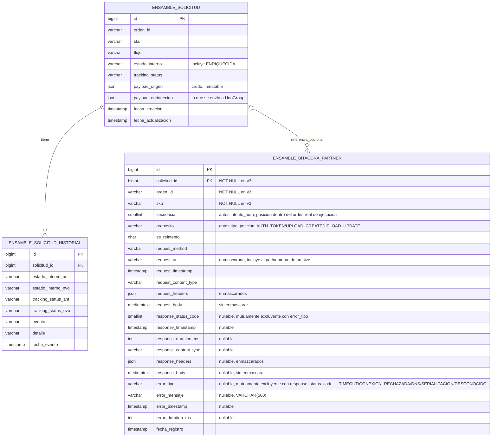

# Diseño / Requerimientos — Módulo de Integración de Servicios de Ensamble

**Proyecto:** HUENSA-001 — Integración de Pedidos que Requieren Ensamble
**Documento:** principios, arquitectura, contrato público (OpenAPI), casos de uso, mapeo de campos y contrato del partner. Describe el diseño **vigente hoy**.
**Diagrama de referencia:** `ArquitecturaDiagramaEnsambles.png` — actualizado, refleja la arquitectura de dos microservicios (§2).

> **Historial de cambios, hallazgos de auditoría y preguntas abiertas:** ver `HUENSA-001_Diseno_Bitacora_Decisiones_Modulo_Integracion_Ensamble.md`. Este documento solo describe el estado actual acordado; no lleva changelog ni anotaciones de sesión.

**Cómo está organizado este documento:**
1. **Por qué y hasta dónde** (§1) — el principio de diseño y el alcance acordado.
2. **Qué se construye** (§2) — la arquitectura conceptual de los dos microservicios.
3. **Cómo se ve en concreto** (§3–5) — casos de uso, mapeo de campos y el contrato formal (OpenAPI).
4. **El contrato del partner** (§6) — el contrato real de Solution One, tal como opera hoy.
5. **Lo que falta decidir** (§7–8) — preguntas de negocio abiertas y próximos pasos.

---

## Índice

1. [Principios y Alcance](#1-principios-y-alcance)
2. [Arquitectura de los Microservicios](#2-arquitectura-de-los-microservicios)
3. [Casos de Uso](#3-casos-de-uso)
4. [Mapeo de Campos](#4-mapeo-de-campos--orígenes--api--solution-one)
5. [Especificación OpenAPI](#5-especificación-openapi)
6. [Contrato del Partner — Solution One (PTI-IRRIS-16)](#6-contrato-del-partner--solution-one-pti-irris-16)
7. [Preguntas de Negocio](#7-preguntas-de-negocio)
8. [Supuestos y Próximos Pasos](#8-supuestos-y-próximos-pasos)

---

# 1. Principios y Alcance

## 1.1 Objetivo

Diseñar un componente intermedio entre los orígenes de Siman y el partner de servicios de ensamble (hoy: UnoGroup/Solution One), que actúe como **capa anti-corrupción**: ninguno de los dos extremos (Infor WMS, Solution One) es código propio de Siman, por lo que la lógica de traducción y las reglas de negocio comunes no deben vivir dentro de ninguno de ellos.

**Principio de diseño central:** el módulo protege a Siman en ambas direcciones — de cambios del vendor WMS, y del partner de ensamble. UnoGroup es una relación comercial reciente; si el desempeño del proveedor no resulta satisfactorio, Siman debe poder reemplazarlo sin afectar los orígenes ni el contrato de la API. Por esto el conjunto se llama **Módulo de Integración de Servicios de Ensamble** — sin referencia a UnoGroup ni a Solution One: es de Siman, no del partner, y el nombre sigue siendo válido si el partner cambia.

Este principio se materializa en la separación de microservicios (§2): el microservicio de **Comunicación con UnoGroup** concentra *todo* el conocimiento del partner actual — si UnoGroup es reemplazado, ese microservicio se reescribe o se sustituye, sin tocar el **Orquestador**, que nunca conoce el formato ni el protocolo de Solution One.

## 1.2 Alcance — Fase 1

**Incluido:**
- Dos orígenes: **Infor WMS** y **App de Guías Manuales** (esta última incorporando el formulario de Armado/Desarmado TARM/DARM).
- Generación de archivos JSON de creación y actualización según el contrato de Solution One (PTI-IRRIS-16).
- Gestión de estado interno, idempotencia y reintentos de subida.

**Explícitamente fuera de alcance (confirmado por negocio):**
- Cancelación de órdenes.
- Reprogramación de fechas.
- Confirmación de cierre de ciclo (servicio completado/terminado) desde UnoGroup.

*(Detalle de estas exclusiones: ver §7 "Preguntas de Negocio", puntos 7.1 y 7.2.)*

---

# 2. Arquitectura de los Microservicios

Lo que originalmente era un solo módulo con 3 capas internas (API de entrada → lógica de negocio → adapter) se separa en **dos microservicios independientes**, cada uno desplegable y escalable por separado en GKE:

1. **Microservicio Orquestador** — única puerta de entrada al sistema.
2. **Microservicio de Comunicación con UnoGroup** (`unogroup-app`) — único componente que le habla a Solution One.

## 2.1 Arquitectura general — dos microservicios

> Ver `ArquitecturaDiagramaEnsambles.png` para el diagrama de infraestructura completo (componentes GCP/GKE, Pub/Sub, Cloud SQL, Secret Manager).

**Patrón de comunicación entre microservicios — notificación asíncrona con callback:**
1. El Orquestador llama a UnoGroup con el **`payload_enriquecido` completo** en el body.
2. UnoGroup responde `202` de inmediato y procesa en segundo plano (llamada a Solution One, con su propio ciclo de reintentos).
3. Al terminar, UnoGroup llama de vuelta al Orquestador (callback) con el resultado final y el detalle de **cada intento** (incluyendo `AUTH_TOKEN`, no solo las subidas) — el Orquestador es quien inserta esto en `ensamble_bitacora_partner`, de su propiedad exclusiva.

**Motivo de elegir asíncrono sobre síncrono bloqueante:** el backoff hacia Solution One puede tardar hasta ~31s en el peor caso, y ese tiempo no es necesariamente el mismo para un partner distinto en el futuro (backoff más espaciado) — mantener una conexión HTTP síncrona abierta ese tiempo no escala bien. El callback libera al Orquestador de esperar.

**Topología K8s:**
- **Dos `Deployment` separados, cada uno en su propio `Pod`** — no comparten pod.
- **Dos `Service` de Kubernetes**, uno por microservicio: `svc-orquestador` (destino de Ingress **y** del callback de UnoGroup) y `svc-unogroup` (destino de la notificación del Orquestador).
- **`Cloud SQL Auth Proxy` es sidecar únicamente del pod del Orquestador** — el pod de UnoGroup no lo tiene.
- **Secret Manager solo lo consume el pod del UnoGroup**, confirma el principio de §1.1.
- **Solo el UnoGroup tiene salida hacia `UnoGroup API Ensambles`** — pendiente de infraestructura si hace falta Cloud Router/Cloud NAT para la salida a internet (ver Bitácora, F14).

| Componente | Rol | Tipo |
|---|---|---|
| **DMS/OMS** | Solicitan crear la orden en WMS **y, por separado, publican "Crear Orden Ensamble" al tópico único** — son el publicador real de la creación, no WMS | Origen, sistemas de venta |
| Infor WMS | Solo emite eventos de actualización (`UP05`/`UP06`) — no publica la creación | Origen, SaaS vendor |
| App de Guías Manuales | Genera señales CARM, TARM/DARM — publica al mismo tópico único (ver §2.5) | Origen, desarrollo interno |
| **Tracking (incluye Beetrack y más)** | Publica "Actualización Entrega a Cliente" al mismo tópico — el schema/atributos exactos del mensaje sigue sin definir | Origen, agregador de notificaciones de entrega |
| **Tópico único de Pub/Sub** | Punto de entrada compartido por los cuatro publicadores anteriores | Infraestructura GCP |
| **Microservicio Orquestador** | Única puerta de entrada; completa los datos que UnoGroup necesita cuando el origen no los trae; persiste la solicitud enriquecida; única propiedad de la base de datos; expone la trazabilidad (`GET /solicitudes/{ordenId}`) | Este diseño |
| MySQL (Cloud SQL) | Fuente de verdad — propiedad exclusiva del Orquestador | Persistencia |
| **Microservicio de Comunicación con UnoGroup (`unogroup-app`)** | Recibe el payload completo ya enriquecido, lo traduce al formato de Solution One, gestiona JWT (único con acceso a Secret Manager), sube el archivo, reintenta en el momento, y reporta el resultado por callback — sin estado propio, sin base de datos | Este diseño |
| Solution One (UnoGroup) | Recibe archivo (upload autenticado), valida JSON de forma asíncrona | Destino externo, partner actual |

**Por qué esta separación (y no solo capas dentro de un módulo):** el Orquestador y el microservicio de UnoGroup tienen ciclos de cambio y razones de escalado distintas — el Orquestador puede necesitar consultar RMS/WMS API (I/O variable, picos de volumen atados a WMS), mientras que el de UnoGroup está atado a la disponibilidad y latencia de Solution One. Separarlos permite escalarlos y desplegarlos independientemente, y refuerza el principio de §1.1: el microservicio de UnoGroup es el único lugar del sistema que sabe que UnoGroup/Solution One existe, y no depende de ningún estado compartido para poder ser reemplazado.

## 2.2 Microservicio Orquestador

Responsabilidades:
- Recibe todos los eventos de origen (WMS y Guías Manuales) desde el tópico único de Pub/Sub.
- Aplica idempotencia de creación y fan-out de actualización (ver §2.6).
- **Enriquecimiento:** para cada campo que el contrato de Solution One necesita y el origen no trae, lo completa consultando otra fuente (RMS, WMS API) o derivándolo (ver §4, columna "Fuente / Cómo obtenerlo").
- Persiste la solicitud (enriquecida) en `ensamble_solicitud`, marcando el estado interno `ENRIQUECIDA` cuando termina (ver §2.7).
- Dispara la notificación asíncrona hacia el microservicio de UnoGroup, con el `payload_enriquecido` completo (§2.4).
- Es dueño único de `GET /solicitudes/{ordenId}` — la trazabilidad completa se consulta aquí, incluso para el estado final, que el propio Orquestador escribe al recibir el callback de UnoGroup (§2.4).
- Recibe el callback de UnoGroup con el resultado y el detalle de cada intento HTTP; es quien inserta esas filas en `ensamble_bitacora_partner` (propiedad exclusiva del Orquestador, ver §2.6).

## 2.3 Microservicio de Comunicación con UnoGroup (`unogroup-app`)

Es un servicio **sin estado**, que solo transforma y transporta lo que recibe en el body de la notificación del Orquestador. Esto lo hace verdaderamente reemplazable (§1.1): si UnoGroup se sustituye por otro partner, el nuevo microservicio no hereda ningún acoplamiento de schema.

Responsabilidades:
- Expone un endpoint interno (solo alcanzable dentro del clúster, vía `Service` de Kubernetes con IP tipo `ClusterIP`) que recibe la notificación del Orquestador con el `payload_enriquecido` completo.
- Traduce el payload recibido al formato de Solution One (PTI-IRRIS-16) — nombre de archivo, ruta, query params `path`/`mkdir_parents` (ver §2.9 y §6).
- Gestiona la obtención del JWT (`GET /api/v2/user/token`): sin caché entre solicitudes — cada procesamiento adquiere un token nuevo al inicio, no uno reutilizado hasta su expiración. La renovación automática se refiere al reintento tras `401` (tabla §2.9), no a un ciclo de vida cacheado con refresco proactivo antes de expirar.
- Sube el archivo (`POST /api/v2/user/files/upload`) usando **OpenFeign** como cliente REST.
- Aplica la política de reintentos **de forma síncrona, dentro del mismo hilo** (sin scheduler — ver §2.11).
- Al terminar (éxito o fallo definitivo), **llama de vuelta al Orquestador** (callback) reportando el resultado final y el detalle de cada intento HTTP realizado — incluyendo los de `AUTH_TOKEN`, no solo los de subida. UnoGroup **no escribe en ninguna base de datos**; solo reporta.
- Es el **único** componente del sistema que conoce el formato, las URLs y las particularidades de Solution One/UnoGroup.

**Consecuencia de diseño:** UnoGroup no *contiene* un adapter hacia Solution One — UnoGroup **es** el adapter. No hay ninguna otra responsabilidad de negocio dentro de este microservicio que necesite protegerse de esa capa (a diferencia del Orquestador, que sí tiene lógica propia — idempotencia, fan-out, enriquecimiento). Por eso reemplazar UnoGroup en el futuro significa construir otro microservicio, no sustituir un componente interno.

## 2.4 Comunicación entre microservicios — notificación asíncrona con callback

**Decisión de arquitectura:** el Orquestador y el microservicio de UnoGroup **no se comunican por Pub/Sub** — Pub/Sub es un servicio externo a GKE, y usarlo para comunicación interna entre dos servicios del mismo clúster agregaría un salto de red innecesario. Ambos se hablan por HTTP directo dentro del clúster (DNS interno de Kubernetes), en dos pasos:

**Paso 1 — Orquestador → UnoGroup: notificación con payload completo.**

Con UnoGroup sin acceso a base de datos, el body lleva el `payload_enriquecido` completo:

```json
{
  "ordenId": "SV-RET-20260415-00012",
  "sku": "9013059587",
  "accion": "create",
  "timestamp": "2026-07-13T18:42:03Z",
  "payloadEnriquecido": { "...": "el JSON completo en lenguaje Siman, ver §4" }
}
```

`accion` es un discriminador explícito: el Orquestador lo determina con su propia lógica de idempotencia (§2.6: primera vez que existe `ordenId+sku` → `create`; en cualquier otro caso → `update`) — nunca lo infiere UnoGroup revisando el contenido del payload. Los valores (`create`/`update`) coinciden a propósito con el segmento `{accion}` del path hacia Solution One (§2.9), para no traducir el valor dos veces.

- El Orquestador hace este `POST` inmediatamente después de hacer commit de `payload_enriquecido` y del estado `ENRIQUECIDA` en MySQL.
- UnoGroup responde `202` de inmediato (aceptado, se procesará en segundo plano) — no bloquea al Orquestador mientras dura el ciclo de reintentos hacia Solution One.

**Paso 2 — UnoGroup → Orquestador: callback con el resultado.**

Al terminar de procesar (éxito, o agotar reintentos sin éxito), UnoGroup llama de vuelta al Orquestador con el resultado final y el registro completo de cada transacción HTTP realizada — **modelo `transacciones[]` (v3)**, que reemplaza el antiguo `intentos[]` (campos sueltos acoplados a Solution One) por una transacción HTTP genérica (`metadata` + `request` + `response`/`error`, mutuamente excluyentes):

```json
{
  "ordenId": "SV-RET-20260415-00012",
  "sku": "9013059587",
  "resultadoFinal": "ENVIADA_PARTNER",
  "transacciones": [
    {
      "metadata": { "secuencia": 1, "proposito": "AUTH_TOKEN", "esReintento": false },
      "request": { "method": "GET", "url": "https://data.solution1.us/api/v2/user/token", "timestamp": "2026-07-13T18:42:03.100Z", "headers": { "Authorization": "Basic ***A9x2" } },
      "response": { "statusCode": 200, "timestamp": "2026-07-13T18:42:03.310Z", "durationMs": 210, "body": "{ \"access_token\": \"eyJ...\" }" }
    },
    {
      "metadata": { "secuencia": 2, "proposito": "UPLOAD_CREATE", "esReintento": false },
      "request": { "method": "POST", "url": "https://data.solution1.us/api/v2/user/files/upload?path=siman%2Fcreate%2F...&mkdir_parents=true", "timestamp": "2026-07-13T18:42:03.320Z", "headers": { "Authorization": "Bearer ***WT9a" }, "body": "{ ...SolutionOneCreatePayload... }" },
      "response": { "statusCode": 500, "timestamp": "2026-07-13T18:42:04.162Z", "durationMs": 842 }
    },
    {
      "metadata": { "secuencia": 3, "proposito": "UPLOAD_CREATE", "esReintento": true },
      "request": { "method": "POST", "url": "https://data.solution1.us/api/v2/user/files/upload?path=siman%2Fcreate%2F...&mkdir_parents=true", "timestamp": "2026-07-13T18:42:05.170Z", "headers": { "Authorization": "Bearer ***WT9a" }, "body": "{ ...SolutionOneCreatePayload... }" },
      "response": { "statusCode": 201, "timestamp": "2026-07-13T18:42:05.783Z", "durationMs": 613 }
    }
  ]
}
```

- `url`/`headers` llevan enmascarado obligatorio de valores sensibles (últimos 4 caracteres visibles); `body` **no** se enmascara todavía (limitación conocida v3).
- El Orquestador es quien **inserta** cada elemento de `transacciones` como una fila de `ensamble_bitacora_partner`, y quien transiciona `estado_interno` según `resultadoFinal`. `exitoso` ya no viaja en el contrato ni se persiste — se deriva (`response.statusCode` entre 200 y 299).
- **`nombreArchivo`/`payloadPartner` ya no existen como campos separados** (ni en el contrato ni en `ensamble_solicitud`) — ambos quedan embebidos en cada transacción de subida (`request.url` trae el `path`, `request.body` trae el payload real enviado) y se derivan de ahí cuando se necesitan.
- **Por qué asíncrono y no síncrono bloqueante:** el backoff hacia Solution One puede tardar hasta ~31s en el peor caso (§2.11), y ese tiempo no necesariamente es el mismo si en el futuro se reemplaza el partner por otro con un backoff más espaciado. Mantener abierta una conexión HTTP síncrona ese tiempo no escala bien — el callback libera al Orquestador de esperar.

**Consecuencias de este patrón:**
- UnoGroup no necesita el sidecar `Cloud SQL Auth Proxy` — su huella de acceso se reduce a Secret Manager + salida HTTP hacia Solution One, nada más.
- **Trade-off aceptado:** dos saltos de red en vez de uno (notificación + callback), y hay que manejar el caso en que el callback mismo se pierda — cubierto por el job de reconciliación (§2.11), que cubre "notificado pero sin callback recibido en X minutos", no solo "sin notificar".

`request.method`/`request.url` son obligatorios en el contrato para cada transacción — el callback siempre trae un método y una URL reales por intento, sin necesidad de valores por defecto.

*(Autenticación entre servicios dentro del clúster para ambos endpoints internos sigue sin definirse — ver Bitácora, F8.)*

## 2.5 Interfaz de entrada (pública) — Orquestador

**Principio:** el contrato de entrada se expresa en **lenguaje de Siman** — nombres de campo en español, legibles por humanos (ej. `ordenId`, `nombreCliente`, `telefonoCliente`) — no en los códigos crudos del sistema origen ni en el formato del partner.

**Un solo tópico de entrada:** tanto WMS como Guías Manuales publican al **mismo tópico único de Pub/Sub**. Con cinco flujos de negocio (ASSE, ENSA, CARM, TARM, DARM) y dos orígenes distintos compartiendo un solo tópico, el Orquestador distingue cuál es cuál mediante **atributos del mensaje de Pub/Sub** (`message.attributes`), no un envelope en el body:

| Atributo | Valores | Propósito |
|---|---|---|
| `origen` | `wms` o `guias` | Distingue el sistema publicador |
| `flujo` | `ASSE`, `ENSA`, `CARM`, `TARM`, `DARM` o *(ausente)* | Distingue el flujo de negocio dentro del origen — **requerido para `origen=guias`, no aplica para `origen=wms`** |
| `tipo_evento` | Códigos nativos del origen — para WMS: `CREAR`, `UP05`, `UP06`; para Guías: `creacion`, `actualizacion` | Distingue creación de actualización, y qué tipo de actualización, sin tener que inferirlo del body ni del estado actual de la sub-orden |

**Se descartaron explícitamente:** `país`, `bodega` y `estado` como atributos adicionales.
- `país` y `bodega` ya son datos que el Orquestador deriva/consulta como parte de su propio trabajo de enriquecimiento (§4.1) — duplicarlos como atributos de transporte no aporta valor hoy.
- `estado` se descartó por principio: si hubiera llevado el `tracking_status` de Siman (`creada`/`alistada`/`despachada`), habría obligado a los orígenes (WMS, Guías) a conocer el vocabulario interno de estados de Siman — justo lo que la capa anti-corrupción (§1.1) busca evitar. Esa traducción sigue siendo responsabilidad exclusiva del Orquestador.
- `tipo_evento`, en cambio, sí es aceptable porque lleva vocabulario **propio del origen** (`UP05`/`UP06` es cómo WMS ya llama a sus propios eventos) — solo que ahora viaja como metadato de transporte en vez de mezclado en el body.

**`flujo` no es `required` para `origen=wms`:** `DMS/OMS` no puede conocer ASSE/ENSA al momento de publicar — el flujo se determina **por línea**, dentro de `orderdetails[].ext_udf_str10`, después de que el Orquestador consulta `GET .../shipment/get-shipment/{whseId}/{externOrderKey}` (§4.1). Una misma orden puede tener líneas ASSE y líneas ENSA a la vez, así que no existe un valor único de `flujo` que la orden completa pueda llevar como atributo de transporte. Para `origen=wms`, el ruteo al mapper depende solo de `origen`+`tipo_evento`; ASSE/ENSA quedan como valores puramente internos, asignados por sub-orden dentro del Orquestador. Para `origen=guias`, `flujo` (`CARM`/`TARM`/`DARM`) sigue siendo `required`, porque ahí sí lo conoce quien publica.

**Canales y endpoints (Orquestador):**

| Endpoint | Canal | Caller |
|---|---|---|
| `POST /internal/eventos` | GCP Pub/Sub push — un único endpoint fijo para el tópico único de entrada (WMS + Guías Manuales) | Google Cloud (Pub/Sub push, JWT de OIDC) |
| `GET /solicitudes/{ordenId}` | REST | Trazabilidad/soporte |

En modo push, Pub/Sub no arma requests distintas por flujo ni conoce rutas de negocio — siempre hace el mismo `POST` a esta única URL, con un sobre fijo (`{ message: { data (base64), attributes, messageId, publishTime }, subscription }`). El Orquestador decodifica el `data` y lee los `attributes` (`origen`, `flujo`) **dentro** de este único endpoint para decidir qué lógica de negocio ejecutar. El ruteo por flujo es responsabilidad de la aplicación, no del transporte.

Los antiguos endpoints REST de Guías Manuales (`POST/PATCH /guias/carm`, `/guias/tarm`, `/guias/darm`) **quedan retirados** del contrato de entrada — ese origen ahora entra únicamente por Pub/Sub, igual que WMS.

**Patrón asíncrono:** el consumo del evento de Pub/Sub no bloquea al publicador — el procesamiento (incluyendo enriquecimiento y la llamada síncrona al microservicio de UnoGroup) ocurre dentro del ciclo de vida normal del consumer.

**Extensibilidad (Fase 2):** cancelaciones y reprogramaciones se agregarían como nuevos tipos de evento sobre el mismo tópico — pendiente de confirmar con UnoGroup qué operaciones soportará el partner.

## 2.6 Modelo de datos — identidad, idempotencia y propiedad exclusiva del Orquestador

**Nota de nomenclatura:** el contrato público usa `ordenId` (no `external_reference`, que es el nombre crudo que espera el partner — esa traducción es responsabilidad del adapter en el microservicio de UnoGroup, no del modelo de datos).

`ordenId` cumple **dos roles distintos**, no son llaves competidoras:

| Operación | Llave usada | Comportamiento |
|---|---|---|
| **Create** | `ordenId + sku` (compuesta) | Si ya existe esa combinación exacta → idempotente, no duplica. Si `ordenId` existe pero `sku` es nuevo → crea sub-orden adicional bajo la misma partición (pedido multi-ítem). |
| **Update sin `sku`** | `ordenId` (partición) | Fan-out: aplica el cambio a todos los skus registrados bajo esa partición. |
| **Update con `sku`** | `ordenId + sku` (compuesta) | Aplica el cambio solo a esa sub-orden. Si el sku no está registrado → anomalía, no creación implícita. |

**La base de datos es propiedad exclusiva del Orquestador:**
- El Orquestador escribe/actualiza `ensamble_solicitud` (incluyendo el estado final, tras recibir el callback de UnoGroup — §2.4), y todas las transiciones en `ensamble_solicitud_historial`.
- El Orquestador también escribe `ensamble_bitacora_partner`, insertando lo que UnoGroup le reporta por callback — **UnoGroup no escribe en ninguna tabla**.
- **Motivo:** con base de datos compartida, reemplazar UnoGroup por otro partner implicaría coordinar un schema que otro servicio también posee. Sin acceso a MySQL, UnoGroup es un servicio sin estado, verdaderamente desechable.
- **Trade-off aceptado:** dos saltos de red (notificación + callback, §2.4) en vez de una llamada con lectura directa a base de datos — y hay que manejar el caso en que el callback se pierda (cubierto por reconciliación, §2.11).

**Nomenclatura de tablas — schema físico compartido:** la instancia/schema de Cloud SQL donde viven estas tablas es compartida con otros sistemas de Siman ajenos al módulo de ensambles (no solo con `unogroup-app`). Para evitar colisiones de nombre, las tres tablas del módulo adoptan el prefijo **`ensamble_`**:

| Nombre anterior | Nombre con prefijo |
|---|---|
| `solicitud_ensamble` | `ensamble_solicitud` *(no `ensamble_solicitud_ensamble`, para evitar redundancia)* |
| `solicitud_historial` | `ensamble_solicitud_historial` |
| `bitacora_partner` | `ensamble_bitacora_partner` |

El mismo prefijo se aplica a los constraints, índices y el trigger de la tabla principal (ver DDL en el documento de Implementación). Esto es puramente nomenclatura para convivir en un schema compartido — no cambia quién escribe cada tabla ni el modelo de datos.

**Tablas:**

| Tabla | Propósito |
|---|---|
| `ensamble_solicitud` | Registro principal por sub-orden. Incluye el estado interno `ENRIQUECIDA` (§2.7) y la columna `payload_enriquecido`. |
| `ensamble_solicitud_historial` | Registra transiciones de `estado_interno`/`tracking_status` (eventos de negocio). No duplica el detalle de cada llamada HTTP — eso vive exclusivamente en `ensamble_bitacora_partner`. |
| `ensamble_bitacora_partner` | Única fuente de verdad de "qué pasó en cada transacción HTTP hacia Solution One" (auth, upload, reintentos) — poblada por el Orquestador a partir del callback de UnoGroup (`transacciones[]`, v3). |

**Dos columnas de payload en `ensamble_solicitud` (v3 — `payload_partner` se elimina, ver más abajo):**

| Columna | Quién escribe | Contenido |
|---|---|---|
| `payload_origen` | Orquestador, una sola vez, al recibir el evento | El crudo tal como llegó — inmutable, solo para auditoría/replay |
| `payload_enriquecido` | Orquestador, al completar el enriquecimiento | El JSON completo en lenguaje Siman, con todos los campos ya rellenados — esto es lo que se envía a UnoGroup en la notificación (§2.4) |

**`payload_partner` y `nombre_archivo` se eliminan de `ensamble_solicitud` en v3** — quedaban redundantes frente a `ensamble_bitacora_partner`, que ahora captura esta información por transacción (`request_body`/`request_url` de la última `UPLOAD_CREATE`/`UPLOAD_UPDATE`), ligada al intento HTTP puntual que la generó en vez de a un único valor "actual" por sub-orden. Si algún flujo necesita "el último payload/archivo usado para esta sub-orden", se consulta desde `ensamble_bitacora_partner` en vez de leer una columna:

```sql
-- Último payload enviado (antes: ensamble_solicitud.payload_partner)
SELECT request_body FROM ensamble_bitacora_partner
WHERE solicitud_id = :solicitudId AND proposito IN ('UPLOAD_CREATE', 'UPLOAD_UPDATE')
ORDER BY secuencia DESC LIMIT 1;
```

El nombre/ruta de archivo (antes `nombre_archivo`) ya no es una columna separada — viaja embebido en `request_url` (query param `path`); extraerlo requiere conocer el formato de Solution One (`SolutionOneFileNaming`), así que esa extracción vive en un helper de aplicación (`orquestador-app`), no en SQL ni en el contrato.

**Estructura jerárquica interna:**

```
ordenId (partición)
  └─ sku (sub-orden única)
       ├─ estado_interno / tracking_status actual
       ├─ archivo(s) generados/subidos a Solution One
       └─ historial de eventos de negocio (auditoría)
```

### 2.6.1 Diagrama entidad-relación



**Cambios de v3 respecto al modelo anterior:** `ensamble_bitacora_partner` reemplaza el modelo de columnas sueltas y acopladas a Solution One (`tipo_peticion`, `url`, `metodo_http`, `codigo_http`, `respuesta_body`, `intento_num`, `exitoso`) por una transacción HTTP genérica (`request_*`/`response_*`/`error_*`), válida para cualquier partner futuro — `exitoso` ya no se persiste, se deriva de `response_status_code BETWEEN 200 AND 299` (o de la presencia de `error_tipo`, si no hubo respuesta); `response_*` y `error_tipo` son mutuamente excluyentes (reforzado con `CHECK`). `orden_id`/`sku` dejan de ser nullable — en el contrato v3 viven siempre en `ResultadoSolicitud` (nivel superior), así que toda transacción, incluidas las de `AUTH_TOKEN`, ya viene asociada a una orden/sku. `ensamble_solicitud` pierde `payload_partner` y `nombre_archivo` (ver más arriba).

**Dueño de escritura por tabla:**

| Tabla | Escribe el Orquestador | Escribe el UnoGroup |
|---|---|---|
| `ensamble_solicitud` | Sí, en su totalidad — crea la fila, la enriquece, y transiciona hasta el estado final al recibir el callback | No — sin acceso a base de datos |
| `ensamble_solicitud_historial` | Sí, en su totalidad | No |
| `ensamble_bitacora_partner` | Sí — inserta lo que UnoGroup le reporta por callback | No — UnoGroup solo *reporta*, nunca escribe directamente |

## 2.7 Ciclo de vida interno de la solicitud (`estado_interno`)

Este enum vive en la capa de persistencia (`ensamble_solicitud.estado_interno`) y describe en qué punto del pipeline entre los dos microservicios está una solicitud. No confundir con `tracking_status` (§2.8), que es el estado de negocio espejo del contrato del partner.

```
RECIBIDA → ENRIQUECIDA → ENVIADA_PARTNER → ACEPTADA_PARTNER / RECHAZADA_PARTNER
```

- **`RECIBIDA`** — el Orquestador consumió el evento de Pub/Sub y creó la fila, antes de completar el enriquecimiento.
- **`ENRIQUECIDA`** — el Orquestador terminó de completar los datos que faltaban; la fila está lista para notificar al microservicio de UnoGroup con el `payload_enriquecido` completo (§2.4).
- **`ENVIADA_PARTNER`** — el microservicio de UnoGroup subió el archivo a Solution One (recibió `201`).
- **`ACEPTADA_PARTNER` / `RECHAZADA_PARTNER`** — estado terminal, sujeto a que exista un mecanismo de confirmación de contenido (§2.10, pendiente de confirmar con UnoGroup).

**No existe el estado `EN_PROCESO`:** en el modelo actual (consumo de un único mensaje de Pub/Sub por instancia, sin polling ni competencia por filas) no hace falta un estado para evitar que dos workers concurrentes tomen la misma fila.

**Detección de solicitudes atascadas:** no se usa un estado intermedio adicional para esto — se cubre con el job de reconciliación (§2.11), que revisa periódicamente filas que llevan demasiado tiempo en `RECIBIDA` o en `ENRIQUECIDA` sin avanzar.

## 2.8 Máquina de estados de negocio (`tracking_status`)

Estados del contrato de Solution One (`tracking_status`): `creada → alistada/despachada → entregada`, más `retornada` (sin flujo que lo dispare, fuera de alcance Fase 1).

**Casos de anomalía identificados, pendientes de definir la acción exacta:**
- Update con `sku` que no está registrado bajo ese `ordenId` → anomalía, no se crea implícitamente.
- Update huérfano (`ordenId` no conocido en absoluto) → posible condición de carrera (creación aún no procesada); requiere margen corto de reintento/espera antes de declararlo anomalía real.
- Transición de estado hacia atrás (ej. `entregada → despachada`) → a definir si se ignora, se loguea como anomalía, o se rechaza.

*(Pendiente: tabla completa de transiciones válidas vs. anómalas — ver Bitácora, F1.)*

## 2.9 Adapter de partner — interfaz de salida hacia Solution One

Contrato confirmado por PTI-IRRIS-16 (Rev. 03):

- **Autenticación:** `GET /api/v2/user/token` (Basic Auth) → JWT. Sin caché — se obtiene un token nuevo en cada procesamiento (nunca uno reutilizado hasta expirar), y se renueva de nuevo si la subida responde `401` (una sola vez, ver tabla de reintentos más abajo).
- **Carga:** `POST /api/v2/user/files/upload` — el body es **binario** (`--data-binary`), con `Content-Type: application/json`. Un único archivo por solicitud, cuyo contenido es el JSON del contrato, con nombres de campo `customer_*` (no `customer_location_*`).
- **Query parameters** (no van en el path ni en el body):

| Parámetro | Ejemplo | Descripción |
|---|---|---|
| `path` | `siman%2Fcreate%2F20260713%2Fcreate_20260410050000_9013059587_104929691.json` | Ruta completa del archivo, URL-encoded (barras `/` → `%2F`). |
| `mkdir_parents` | `true` | Debe ser `true` siempre. Si es `false` y la carpeta padre no existe, la API responde `403 Forbidden`. |

- **Estructura de carpetas vigente:** `/siman/create/{fecha}/...` para creación, `/siman/update/{fecha}/...` para actualización. Path completo: `{ruta-base}/{accion}/{fecha}/{accion}_{timestamp}_{external_reference}_{sku}.json` con `ruta-base=siman`.
- **Cliente REST:** OpenFeign, con encoder binario personalizado — `Content-Type: application/json` es correcto para el body binario.
- **Política de reintentos** — síncrona, en el mismo hilo del procesamiento, no en un worker programado (ver §2.11):

| Código | ¿Reintentar? | Acción |
|---|---|---|
| 400 | No automático | Corregir y reenviar con nuevo timestamp |
| 401 | Sí, una vez | Renovar token y reintentar |
| 403 | No | Detener, escalar — puede ser permisos **o** `mkdir_parents=false` |
| 413 | No | Validar tamaño, escalar |
| 500 | Sí | Backoff exponencial, máx. 5 intentos (~31s en total) |

**Decisiones tomadas sin confirmación directa de UnoGroup (no bloquean implementación):**
- Longitud de `external_reference`: se fija en **32**, el menor de los dos valores documentados en el contrato — evita truncamiento silencioso o rechazo si UnoGroup en realidad usa el límite más corto.
- El nombre de archivo de actualización usa prefijo `update` (por simetría con `create`), y siempre incluye `sku` — es lo que le permite a UnoGroup identificar la sub-orden exacta cuando el body de actualización no lo lleva.

## 2.10 Confirmación de aceptación/rechazo del partner

El contrato documentado (PTI-IRRIS-16) solo cubre el sentido Siman → Solution One. No hay ningún mecanismo de retorno documentado.

**Opciones reales, de más a menos exigente para UnoGroup:**
1. **Webhook** — poco probable si Solution One es un producto genérico de transferencia de archivos.
2. **Polling a un endpoint de estado** — no documentado en el instructivo actual.
3. **Polling de un archivo de resultado** — coherente con cómo opera el sistema hoy (todo basado en archivos).
4. **Reporte manual/dashboard** — mínimo esperable.
5. **Sin feedback alguno** — riesgo documentado, no diseño objetivo.

**Decisión de diseño (sin esperar la respuesta de UnoGroup):** el microservicio de UnoGroup se prepara para soportar cualquiera de las opciones 1–3 sin rediseño — ya sea por un endpoint receptor (webhook) o por un job de polling, el resultado transiciona la sub-orden a `ACEPTADA_PARTNER`/`RECHAZADA_PARTNER`.

## 2.11 Resiliencia — reintentos y reconciliación

**Reintentos hacia Solution One (dentro del microservicio de UnoGroup):** síncronos, en el mismo hilo que procesa la solicitud — sin `@Scheduled`, sin tabla de polling. La ventana total de reintento es de segundos (backoff 1s→2s→4s→8s→16s, máx. 5 intentos ≈ 31s), no justifica la complejidad de un worker persistente ni el riesgo de que N réplicas del pod ejecuten el mismo job en paralelo. Con Java 21, el uso de `Thread.sleep` entre intentos dentro de un virtual thread es barato y no bloquea un hilo de plataforma real.

**Reintento de la notificación (Orquestador → UnoGroup):** corto, en el momento (2-3 intentos con backoff de segundos) — cubre blips transitorios de red dentro del clúster, que es la inmensa mayoría de los casos.

**Reintento del callback (UnoGroup → Orquestador):** 5 intentos, backoff exponencial desde 500ms (×2, ≈15.5s total) — más resiliente que la notificación entrante porque perder esta llamada significa perder el resultado del procesamiento sin dejar ningún estado consultable (UnoGroup no persiste nada). Si se agotan los intentos, se registra en logs estructurados y queda en manos de la reconciliación (zona 3) como red de seguridad final.

**Job de reconciliación — único mecanismo de "red de seguridad", cubre tres zonas atascadas:**

| Zona | Síntoma de "atascado" | Cómo lo detecta la reconciliación |
|---|---|---|
| Ingesta (Pub/Sub → Orquestador) | Fila en `RECIBIDA` por más de N minutos sin pasar a `ENRIQUECIDA` (ej. el Orquestador se cayó a media consulta a RMS/WMS API) | El job la encuentra por antigüedad del estado y alerta |
| Orquestador → UnoGroup (notificación) | Fila en `ENRIQUECIDA` por más de N minutos sin recibir el callback de UnoGroup (ej. la notificación se perdió del todo, o UnoGroup cayó antes de poder llamar de vuelta) | El job la encuentra por antigüedad del estado y alerta |
| UnoGroup → Orquestador (callback) | UnoGroup sí procesó y llamó a Solution One, pero el callback mismo se perdió; el Orquestador nunca se entera del resultado | ⚠ Requiere que UnoGroup deje algún rastro fuera de su propia base de datos (que no tiene) para que esta zona sea detectable — mecanismo a definir (ver Bitácora, F16) |

- Frecuencia: infrecuente (orden de 15-30 min) — no es un mecanismo de tiempo real, es una red de seguridad para el caso raro donde el camino feliz (evento + notificación + callback) falló por completo.
- **No se usa el DLQ de Pub/Sub como mecanismo de alerta.** El tópico de entrada sí tiene (o debería tener) una Dead Letter Queue configurada para mensajes que agotan reintentos de entrega, pero hoy es solo un buzón sin monitoreo activo — el job de reconciliación sobre `estado_interno` es la red de seguridad real, no el DLQ.
- MySQL sigue siendo la fuente de verdad para el Orquestador en todos los casos: la llamada HTTP y el DLQ son disparadores para evitar polling constante, no el lugar donde vive el dato. Esto no aplica de la misma forma a UnoGroup, que no tiene base de datos — su única fuente de verdad sobre un intento en curso es su propia memoria de proceso mientras dura la ejecución.

---

# 3. Casos de Uso

Cinco flujos de negocio cubiertos por la HU. Todos entran por el mismo tópico único de Pub/Sub hacia el microservicio Orquestador — no hay distinción entre "REST directo" y "Pub/Sub" según el origen.

**Mapeo UC → Endpoint → Canal:**

| Caso de uso | Recibido por | Canal |
|---|---|---|
| UC1 — ASSE (armado domicilio, WMS) | Orquestador | Pub/Sub (tópico único) |
| UC2 — ENSA (armado CD, WMS) | Orquestador | Pub/Sub (tópico único) |
| UC3 — CARM (armado domicilio, guía manual) | Orquestador | Pub/Sub (tópico único) |
| UC4 — TARM (armado tienda, formulario nuevo) | Orquestador | Pub/Sub (tópico único) |
| UC5 — DARM+CARM (3 momentos) | Orquestador | Pub/Sub (tópico único) |

> En todos los casos, una vez que el Orquestador marca la fila como `ENRIQUECIDA`, notifica al microservicio de UnoGroup con el `payload_enriquecido` completo (§2.4), que ejecuta la subida a Solution One (§2.9) y reporta el resultado por callback.

## 3.1 UC1 — Ensamble a domicilio desde pedido WMS (ASSE)

**Trigger:** una línea de la orden trae `orderdetails[].ext_udf_str10 = "ASSE"` en la respuesta del shipment
**Canal:** GCP Pub/Sub (tópico único de entrada)

El evento de creación que publica `DMS/OMS` **no trae los datos de negocio** — es un disparador mínimo con solo `whseId`+`externOrderKey` (`EventoWmsCrear`). El Orquestador **siempre** consulta `GET /wms/dw/v1/shipment/get-shipment/{whseId}/{externOrderKey}` (`WmsShipmentDetail`) para obtener los datos reales y determinar, **por línea**, si el ítem es ASSE, ENSA, o no requiere ensamble. El atributo `flujo` de Pub/Sub no aplica para `origen=wms` (queda opcional en el contrato — ver §2.5).

1. Cliente compra un producto que requiere armado a domicilio.
2. DMS/OMS solicitan crear la orden en WMS y, por separado, publican el evento mínimo de creación (`EventoWmsCrear`, solo `whseId`+`externOrderKey`) al tópico único.
3. El Orquestador consume el evento → consulta `GET .../shipment/get-shipment/{whseId}/{externOrderKey}` → filtra `orderdetails[]` por `ext_udf_str10` no nulo → por cada línea con `ext_udf_str10="ASSE"`, crea una sub-orden (`estado_interno = RECIBIDA`), la enriquece con los datos ya obtenidos en esa misma respuesta, y pasa a `ENRIQUECIDA`. Las líneas con `ext_udf_str10="ENSA"` de la misma orden siguen el flujo de UC2 en paralelo; las líneas con `ext_udf_str10=null` se ignoran.
4. El Orquestador notifica al microservicio de UnoGroup con el `payload_enriquecido` completo, que genera y sube el archivo JSON de creación hacia Solution One, y reporta el resultado por callback (`estado_interno = ENVIADA_PARTNER`).
5. **Infor WMS** (no `DMS/OMS`) publica el evento de actualización `UP06` al despachar el pedido, con `tipo_evento=UP06` en los atributos del mensaje. El payload crudo (`WmsUP06Payload`) es también solo un disparador — el Orquestador extrae `whseId`+`externOrderKey` de cada orden dentro de `Head[]` (ver §3.2, fan-out de dos niveles) → repite la consulta al shipment → actualiza `tracking_status` a `despachada` en **todas** las sub-órdenes ya registradas bajo ese `ordenId` que califiquen (sin despachos parciales, no hace falta cruzar contra `pickDetail[]`) → repite el ciclo de enriquecimiento/envío para la actualización.
6. Beetrack transporta y entrega físicamente el producto al cliente.
7. **Tracking (incluye Beetrack)** publica "Actualización Entrega a Cliente" al mismo tópico — el canal ya está confirmado (Pub/Sub), pero el schema/atributos de este mensaje sigue sin definir (ver Bitácora, F13).
8. El Orquestador actualiza `tracking_status` a `entregada` → dispara actualización hacia Solution One.
9. UnoGroup asigna proveedor y ejecuta el armado en domicilio.

> **Gap (Fase 1):** no hay evento de "armado completado" que regrese desde UnoGroup hacia Siman. Fuera de alcance Fase 1.

---

## 3.2 UC2 — Ensamble en Centro de Distribución desde pedido WMS (ENSA)

**Trigger:** una línea de la orden trae `orderdetails[].ext_udf_str10 = "ENSA"` en la respuesta del shipment
**Canal:** GCP Pub/Sub (tópico único de entrada)

Comparte el mismo mecanismo de UC1 (§3.1) — mismo evento mínimo de creación, misma consulta al shipment. La única diferencia real es el valor de `ext_udf_str10` de la línea, que determina `service_location` (ASSE→casa, ENSA→centro_distribucion) y quién ejecuta el armado. Una misma orden puede generar sub-órdenes ASSE y ENSA simultáneamente si tiene líneas de ambos tipos.

1. Cliente compra un producto con ensamble en CD.
2. DMS/OMS solicitan crear la orden en WMS y publican el mismo evento mínimo de creación (`EventoWmsCrear`) al tópico.
3. El Orquestador consume el evento → consulta el shipment → filtra `orderdetails[]` → por cada línea con `ext_udf_str10="ENSA"`, crea sub-orden → enriquece → dispara envío de creación hacia Solution One.
4. Almacén completa el empaque (Pack Completado) → **Infor WMS** publica el evento `UP05` al tópico, con `tipo_evento=UP05` en los atributos. Igual que UP06, `WmsUP05Payload` es solo disparador — el Orquestador extrae `whseId`+`externOrderKey` del único objeto `Head` (UP05 no tiene el arreglo de UP06 — 1 evento = 1 orden) → consulta el shipment → actualiza `tracking_status` a `alistada` en las sub-órdenes calificadas → dispara actualización.
5. UnoGroup ejecuta el armado en el CD, antes de que el producto salga a reparto. Beetrack no interviene en esta señal.
6. (Implícito) El producto, ya ensamblado, continúa el flujo normal de despacho/entrega.

> **Gap (Fase 1):** no hay evento de "armado completado en CD" que confirme a WMS que ya puede despachar. Fuera de alcance Fase 1.

---

## 3.3 UC3 — Venta en caja con ensamble a domicilio (CARM) desde Guía Manual

**Trigger:** operador marca selector "¿requiere ensamble?" = Sí en la guía de Retiro y Entrega
**Canal create y update:** GCP Pub/Sub (tópico único)

1. Cliente compra producto en caja y no se lo lleva.
2. Operador genera la guía de Retiro y Entrega en el aplicativo de guías manuales.
3. Operador marca el selector de ensamble = Sí.
4. App de Guías publica **un único evento CARM al tópico, con todos los SKUs de la guía en `items[]`** → el Orquestador consume, hace el fan-out (una sub-orden por SKU), enriquece cada una, dispara envío de creación hacia Solution One por separado.
5. Beetrack despacha y entrega el producto al cliente.
6. **Tracking (incluye Beetrack)** publica "Actualización Entrega a Cliente" al tópico — canal confirmado (Pub/Sub), schema/atributos aún sin definir (ver Bitácora, F13).
7. El Orquestador recibe la notificación (mecanismo pendiente) → actualiza `tracking_status` a `entregada` de cada sub-orden asociada → dispara actualización hacia Solution One.
8. UnoGroup ejecuta el armado en domicilio.

App de Guías publica **1 evento por guía/orden**, no 1 evento por ítem — la guía lleva `items[]` con todos los SKUs. Es el **Orquestador** quien divide esa solicitud en N sub-órdenes (una por SKU) antes de enviarlas a Solution One/UnoGroup. Ver schema `EventoGuias` (openapi §components/schemas).

---

## 3.4 UC4 — Armado de exhibición en tienda (TARM) desde Formulario nuevo

**Trigger:** operador completa el formulario nuevo con tipo = Armado, ubicación = tienda
**Canal create y update:** GCP Pub/Sub (tópico único)

**Confirmado:** el formulario nuevo de Armado/Desarmado (TARM/DARM) vive **dentro del aplicativo de guías manuales existente**, como un tipo de formulario adicional — no es un aplicativo separado.

1. Cliente compra un producto de exhibición.
2. Operador completa el formulario nuevo: tipo de orden, tienda solicitante, departamento, ítem(s).
3. Formulario publica **un único evento TARM al tópico, con todos los SKUs en `items[]`** → el Orquestador hace el fan-out (una sub-orden por SKU) → enriquece cada una → dispara envío de creación hacia Solution One.
4. UnoGroup ejecuta el armado dentro de la misma tienda.
5. ⚠ No hay mecanismo definido para notificar al módulo que el servicio se completó.

Mismo patrón que CARM — 1 evento por formulario/orden, con `items[]`; el Orquestador hace el fan-out. Ver schema unificado `EventoGuias`.

> **Gaps:** canal de update sin definir + `tracking_status` de cierre sin valor válido en el contrato de Solution One. Pendiente de confirmar con UnoGroup.

---

## 3.5 UC5 — Venta con ensamble desde exhibición: 3 momentos (DARM → retiro/entrega → CARM)

**Trigger:** cliente compra producto armado en exhibición que debe entregarse desarmado
**Canal (los 3 momentos):** GCP Pub/Sub (tópico único)

### 3.5.1 Momento 1 — Desarmado en tienda

1. Operador completa el formulario nuevo: tipo = Desarmado (DARM), tienda solicitante, ítem(s).
2. Operador registra el vínculo a la futura guía de retiro/entrega.
3. Formulario publica **un único evento DARM al tópico, con todos los SKUs en `items[]`** → el Orquestador hace el fan-out (una sub-orden por SKU) → enriquece cada una → dispara envío de creación hacia Solution One.
4. UnoGroup ejecuta el desarmado en tienda.
5. ⚠ Canal de cierre del desarmado sin definir (mismo pendiente que UC4).

Mismo patrón que CARM/TARM — 1 evento por formulario/orden, con `items[]`; el Orquestador hace el fan-out. Ver schema unificado `EventoGuias`.

### 3.5.2 Momento 2 — Retiro y entrega

1. Se genera la guía tradicional de Retiro y Entrega, vinculada a la orden DARM.
2. Beetrack despacha y entrega el producto desarmado en el domicilio del cliente.

### 3.5.3 Momento 3 — Armado en domicilio (= UC3/CARM)

1. Selector de ensamble en la guía = Sí → un único evento CARM al tópico con `items[]` → el Orquestador hace el fan-out (una sub-orden por SKU) → un archivo JSON de creación por sub-orden.
2. Beetrack notifica entrega vía **Tracking** (Pub/Sub, canal confirmado — schema pendiente, ver Bitácora F13) → actualiza a `entregada`.
3. UnoGroup ejecuta el armado en domicilio.

> **Gap:** el vínculo entre la orden DARM (momento 1) y la orden CARM (momento 3) es un campo interno del formulario de Siman. No está confirmado si ese vínculo se envía también a Solution One/UnoGroup.

---

**Patrón que se repite en los 5 casos:** todos terminan en UnoGroup ejecutando el servicio, y en ninguno hay un evento de "servicio completado" que regrese hacia Siman — confirmado como fuera de alcance en Fase 1.

---

# 4. Mapeo de Campos — Orígenes → API → Solution One

**Propósito:** para cada campo requerido por el contrato de Solution One (PTI-IRRIS-16), identificar su equivalente en la API del módulo (lenguaje Siman/español), el campo del sistema origen, y cómo obtenerlo si el origen no lo tiene disponible directamente.

> **Sobre el estado del contrato:** el nombre y tipo de cada campo "Campo API (español)" de estas tablas ya está fijado en `HUENSA-001_openapi_V3.yaml` (schemas `PayloadEnriquecido`/`EventoGuias`) — eso es el contrato, y está definido. Lo que marca `desconocido` en la columna "Fuente / Cómo obtenerlo" es si el sistema origen realmente captura ese dato y de dónde sale — una confirmación de negocio pendiente con el equipo dueño del origen, independiente de que el campo ya tenga nombre en la API.

**Convención en "Fuente / Cómo obtenerlo":**
- `origen` — el campo viene directamente del sistema origen, sin consultas adicionales.
- `derivado: <regla>` — se infiere de otro dato ya disponible, sin llamada externa.
- `consulta: <sistema>` — el **microservicio Orquestador** debe consultar otro sistema para obtenerlo.
- `desconocido` — el campo API ya existe en el contrato, pero no está claro de dónde saldrá su valor; pendiente de confirmar con el equipo del sistema origen (ver Bitácora, §"Índice de preguntas abiertas").

---

## 4.1 Tabla 1 — Origen: Infor WMS

Flujos cubiertos: **UC1 (ASSE)** y **UC2 (ENSA)**
Mecanismo de entrada: GCP Pub/Sub — tópico único (compartido con Guías Manuales, ver §2.5)

Los eventos crudos de Pub/Sub (`EventoWmsCrear`, `WmsUP05Payload`, `WmsUP06Payload`) no son fuente de datos de negocio — son solo disparadores (`whseId`+`externOrderKey`). **Toda esta tabla refleja la respuesta de `GET /wms/dw/v1/shipment/get-shipment/{whseId}/{externOrderKey}`** (`WmsShipmentDetail`), que el Orquestador consulta siempre, tanto en creación como en actualización.

| Campo Solution One | Campo API (español) | Campo WMS (`WmsShipmentDetail`) | ¿Disponible? | Fuente / Cómo obtenerlo | Caso(s) de uso |
|---|---|---|---|---|---|
| `external_reference` | `ordenId` | `externorderkey` | ✅ Sí | `origen` — ⚠ tipo string aquí, entero en el evento crudo; normalizar | UC1, UC2 |
| `external_reference_alt_1` | `numeroFactura` | `referencenum` | ✅ Sí (igual a `ext_udf_str7`) | `origen` | UC1, UC2 |
| `external_reference_alt_2` | *(sin nombre API asignado — TBD)* | `susr3` (header) | ⚠ Ver nota 1 | `desconocido` | UC1 |
| `customer_name` | `nombreCliente` | `bcompany` / `ccompany` | ✅ Sí (ambos campos, mismo valor en el ejemplo) | `origen` — ⚠ cuál de los dos usar sin confirmar | UC1 |
| `customer_phone` | `telefonoCliente` | `cphone1` | ✅ Sí | `origen` | UC1 |
| `customer_email` | `correoCliente` | `cemail2` | ⚠ Visto vacío (`""`) en el ejemplo real | `origen` — pendiente confirmar si alguna vez viene poblado | UC1 |
| `customer_vip` | `clienteVip` | `ext_udf_str8` | ⚠ No visto poblado en ejemplos | `desconocido` | UC1 |
| `customer_address` | `direccion` | `caddress1`...`caddress6` | ✅ Sí, fragmentada en 6 campos (varios vacíos) | `origen` — concatenar | UC1 |
| `customer_city` | `ciudad` | `ccity` | ✅ Sí | `origen` | UC1 |
| `customer_state` | `departamento` | `cstate` | ✅ Sí | `origen` | UC1 |
| `customer_country` | `pais` | `ccountry` / `storerkey` → país | ❌ `ccountry` visto `null` en ejemplo real | `derivado: storerkey="AS"→"SV"` (hipótesis, sin confirmar) — ver nota 2 | UC1, UC2 |
| `customer_latitude` | `latitud` | — | ❌ No visto en `WmsShipmentDetail` | `desconocido` | UC1 |
| `customer_longitude` | `longitud` | — | ❌ No visto en `WmsShipmentDetail` | `desconocido` | UC1 |
| `service_type` | `tipoServicio` — valor visto: `"armado"` ⚠ sin confirmar el valor para DARM (¿`"desarmado"`?) | `orderdetails[].ext_udf_str10` | ✅ Confirmado en ejemplo real, a nivel de línea, no de header | `origen` — filtrar líneas con valor no nulo; determina ASSE vs. ENSA por línea | UC1, UC2 |
| `service_location` | `ubicacionServicio` — valor visto: `"casa"` | `orderdetails[].ext_udf_str10` | ✅ Derivable — mismo campo que `service_type` | `derivado: ext_udf_str10="ASSE"→"casa"; "ENSA"→"centro_distribucion"` | UC1, UC2 |
| `service_location_reference` | `referenciaUbicacionServicio` | `whseid` | ✅ Sí | `origen` (solo aplica para ENSA) | UC2 |
| `item_sku` | `sku` | `orderdetails[].sku` | ✅ Sí | `origen` | UC1, UC2 |
| `item_brand` | `marcaProducto` | — | ❌ No visto en `WmsShipmentDetail` | `consulta: RMS con sku` | UC1, UC2 |
| `item_category` | `categoriaProducto` | — | ❌ No visto en `WmsShipmentDetail` | `consulta: RMS con sku` | UC1, UC2 |
| `item_description` | `descripcionProducto` | — | ❌ No visto — `pickinginstructions` es texto libre, no estructurado, no debería ser fuente primaria | `consulta: RMS con sku` | UC1, UC2 |
| `item_quantity` | `cantidad` | `orderdetails[].originalqty` / `shippedqty` | ✅ Sí | `origen` — ⚠ cuál de los dos usar sin confirmar; ver nota 3 | UC1, UC2 |
| `tracking_status` | `estado` | — | N/A — lo gestiona el Orquestador | `derivado: evento=CREAR→"creada"; UP05→"alistada"; UP06→"despachada"` | UC1, UC2 |
| `tracking_order_time` | `fechaOrden` | `adddate` / `orderdate` | ✅ Ambos presentes en ejemplo real | `origen` — ⚠ cuál de los dos usar, ver nota 4 | UC1, UC2 |
| `tracking_dispatch_plan_time` | `fechaPlanificadaDespacho` | `deliverydate` | ⚠ No confirmado si `WmsShipmentDetail` lo trae poblado | `desconocido` | UC1 |
| `tracking_delivery_plan_time` | `fechaPlanificadaEntrega` | — | ❌ Sin origen conocido | `desconocido` | UC1 |
| `tracking_dispatched_time` | `fechaRealDespacho` | `fecha` (evento crudo UP05/UP06) | ⚠ ¿se usa `fecha` del evento crudo, o la hora de recepción del evento en el Orquestador? Ver nota 4 | `desconocido` | UC1 |
| `tracking_delivered_time` | `fechaRealEntrega` | — | ❌ No viene del evento | `desconocido` — depende de cómo llegue la notificación de Beetrack | UC1 |

**Nota sobre `item_sku` en actualizaciones:** el mapeo confirmado de actualización (§4.4) **no incluye `item_sku`/`sku` en el body JSON** — el sku no se pierde, sigue siendo la llave para identificar de cuál sub-orden/archivo se trata, pero esa identificación ya la resuelve la ruta/nombre del archivo (§2.9), no un campo dentro del JSON. Solo aplica en creación.

**Notas:**
1. En el ejemplo real de `WmsShipmentDetail`, `susr3` (header) tiene el mismo valor que `externorderkey` — sugiere que es una copia del identificador de orden, no un dato distinto. `external_reference_alt_2` sigue sin nombre de campo API asignado ni fuente clara.
2. El código ISO de país (`SV`, `GT`, `NI`, `CR`) no aparece explícitamente — `ccountry` se confirmó `null` en el ejemplo real. `storerkey = "AS"` sigue siendo la única hipótesis disponible.
3. La cantidad real viene de `orderdetails[].originalqty`/`shippedqty` en `WmsShipmentDetail`, una línea por ítem.
4. Fuente de `tracking_order_time` (`adddate` u `orderdate`) y de `tracking_dispatched_time`/`tracking_delivered_time` (campo `fecha` del payload crudo vs. hora de recepción en el Orquestador) — pendientes de decidir, ver Bitácora.

---

## 4.2 Tabla 2 — Origen: App de Guías Manuales

Flujos cubiertos: **UC3 (CARM)**, **UC4 (TARM)**, **UC5 (DARM+CARM)**
Mecanismo de entrada: GCP Pub/Sub — tópico único

> ⚠ Esta tabla usa el mismo formato que la Tabla 1 (WMS) para mantener consistencia visual y facilitar la comparación entre orígenes. El schema `EventoGuias` ya está definido en el contrato OpenAPI (nombre y tipo de cada campo) — lo que **no está validado** es si el aplicativo de Guías Manuales realmente captura y puebla cada uno de esos campos. Cada fila marcada `desconocido` corresponde a una pregunta abierta sobre esa captura real — ver el detalle en §4.2.1.

Los tres flujos (CARM/TARM/DARM) comparten un único schema de evento, `EventoGuias` (ver openapi §components/schemas) — un solo evento por orden/guía, con todos los SKUs en `items[]`; el Orquestador hace el fan-out a una sub-orden por SKU. Las filas `item_*` de esta tabla corresponden a campos **dentro** de cada elemento de `items[]`, no a nivel raíz del evento.

| Campo Solution One | Campo API (español) | Campo App de Guías | ¿Disponible? | Fuente / Cómo obtenerlo | Caso(s) de uso |
|---|---|---|---|---|---|
| `external_reference` | `ordenId` | *(número de guía)* | ⚠ Probable — formato a confirmar | `desconocido` | UC3, UC4, UC5 |
| `external_reference_alt_1` | `numeroFactura` | *(taco de retiro/factura)* | ⚠ No confirmado si siempre disponible | `desconocido` | UC3, UC5 |
| `external_reference_alt_2` | *(sin nombre API asignado, ver §4.1)* | *(posible: `guiaRelacionada`)* | ⚠ No aplica salvo vínculo DARM↔CARM; pendiente confirmar si es el mismo campo que `guiaRelacionada` o uno distinto | `desconocido` | UC5 |
| `customer_name` | `nombreCliente` | *(campo de formulario)* | ⚠ No confirmado si es obligatorio | `desconocido` | UC3, UC5 |
| `customer_phone` | `telefonoCliente` | *(campo de formulario)* | ⚠ No confirmado si es obligatorio | `desconocido` | UC3, UC5 |
| `customer_email` | `correoCliente` | *(campo de formulario)* | ⚠ No confirmado si existe | `desconocido` | UC3, UC5 |
| `customer_vip` | `clienteVip` | — | ⚠ No confirmado si el aplicativo lo sabe | `desconocido` | UC3, UC5 |
| `customer_address` | `direccion` | *(campo de formulario)* | ⚠ No confirmado | `desconocido` | UC3, UC5 |
| `customer_city` | `municipio` | *(campo de formulario)* | ⚠ No confirmado | `desconocido` | UC3, UC5 |
| `customer_state` | `departamento` | *(campo de formulario)* | ⚠ No confirmado | `desconocido` | UC3, UC5 |
| `customer_country` | `pais` | — | ⚠ No confirmado cómo se deriva | `desconocido` | UC3, UC5 |
| `customer_latitude` | `latitud` | — | ❌ No visto — sin geocodificación conocida | `desconocido` | UC3, UC5 |
| `customer_longitude` | `longitud` | — | ❌ No visto — sin geocodificación conocida | `desconocido` | UC3, UC5 |
| `service_type` | `tipoServicio` | *(selector "¿requiere ensamble?")* | ⚠ Momento de activación sin confirmar; también podría derivarse del atributo `flujo` en vez de venir explícito del origen | `desconocido` / `derivado: flujo` — a decidir | UC3, UC4, UC5 |
| `service_location` | `ubicacionServicio` | *(tipo de formulario)* | ⚠ Derivable del flujo (CARM=casa, TARM/DARM=tienda) | `derivado: flujo` — a confirmar | UC3, UC4, UC5 |
| `service_location_reference` | `referenciaUbicacionServicio` | *(tienda/CD, si aplica)* | ⚠ Solo en TARM/DARM, sin confirmar | `desconocido` | UC4, UC5 |
| `item_sku` | `items[].sku` | *(campo de formulario, por ítem)* | ✅ Confirmado — 1 evento por guía con N ítems en `items[]` | `origen` | UC3, UC4, UC5 |
| `item_brand` | `items[].marcaProducto` | — | ⚠ Posible que solo capture SKU | `desconocido` | UC3, UC4, UC5 |
| `item_category` | `items[].categoriaProducto` | — | ⚠ Posible que solo capture SKU | `desconocido` | UC3, UC4, UC5 |
| `item_description` | `items[].descripcionProducto` | — | ⚠ No confirmado | `desconocido` | UC3, UC4, UC5 |
| `item_quantity` | `items[].cantidad` | — | ⚠ No confirmado | `desconocido` | UC3, UC4, UC5 |
| `tracking_status` | `estado` | — | N/A — lo gestiona el Orquestador, no el origen | `derivado: máquina de estados del Orquestador` | UC3, UC4, UC5 |
| `tracking_order_time` | `fechaOrden` | *(fecha/hora de creación de guía)* | ⚠ No confirmado si se registra | `desconocido` | UC3, UC4, UC5 |
| `tracking_dispatch_plan_time` | `fechaPlanificadaDespacho` | — | ⚠ No confirmado | `desconocido` | UC3, UC5 |
| `tracking_delivery_plan_time` | `fechaPlanificadaEntrega` | *(fecha estimada de entrega)* | ⚠ No confirmado si se captura | `desconocido` | UC3, UC5 |
| `tracking_dispatched_time` / `tracking_delivered_time` | `fechaRealDespacho` / `fechaRealEntrega` | — | ❌ Bloqueado — depende del canal de Beetrack (sin definir) | `desconocido` | UC3, UC4, UC5 |

### 4.2.1 Preguntas al equipo de App de Guías Manuales

**Sobre identidad de la orden:**
- ¿Cuál es el identificador único de una guía? ¿Es el número de guía completo (`PAIS-ORIGEN-AAAAMMDD-CORRELATIVO`) o existe otro campo?
- ¿El número de factura / taco de retiro siempre está disponible al momento de generar la guía, o puede generarse sin él?
- ¿Existe un número de pedido asociado a la guía?

**Sobre datos del cliente:**
- ¿El formulario captura nombre, teléfono y correo del cliente? ¿Son campos obligatorios?
- ¿Existe alguna forma de saber si el cliente es VIP desde el aplicativo, o hay que consultarlo en otro sistema?

**Sobre ubicación:**
- ¿El formulario captura dirección, municipio y departamento de entrega?
- ¿La aplicación ya usa algún servicio de geocodificación para obtener latitud/longitud, o eso nunca se ha capturado para las guías?

**Sobre el producto:**
- ¿El formulario captura descripción, marca y categoría del producto, o solo el SKU?
- Si solo captura SKU, ¿el aplicativo consulta algún sistema (RMS u otro) para obtener los datos del producto?

**Sobre fechas:**
- ¿El aplicativo registra la fecha y hora en que se genera la guía?
- ¿Se captura una fecha estimada de entrega al cliente?

**Sobre el formulario nuevo (TARM/DARM):** *(confirmado: viven como formularios adicionales dentro del aplicativo de guías existente, no un aplicativo separado — ver §3.4, §3.5.1)*
- ¿Qué campos capturaría ese formulario (tienda, departamento solicitante, SKU, etc.)?
- ¿Quién cierra el servicio TARM o DARM (lo marca como completado), y desde dónde?

**Mecanismo de publicación a Pub/Sub — pendiente:**
- Si `tipoServicio`/`ubicacionServicio` viajan explícitos en el evento o si el Orquestador los deriva del atributo `flujo` (evitar duplicar la fuente de verdad).
- Si `external_reference_alt_2` (vínculo DARM↔CARM) es el mismo dato que `guiaRelacionada` o un campo distinto.

---

## 4.3 Resumen de campos críticos sin origen definido

Estos campos requieren decisión antes de implementar el Orquestador:

| Campo Solution One | Campo API | Problema | Acción requerida |
|---|---|---|---|
| `service_type` / `service_location` | `tipoServicio` / `ubicacionServicio` | No visible en los eventos WMS de ejemplo (UP05/UP06 no traen `ext_udf_str10`) | Confirmar con Simán si el evento trae este campo o si hay que consultar el WMS |
| `tracking_delivery_plan_time` | `fechaPlanificadaEntrega` | Sin origen conocido en ningún sistema | Confirmar con UnoGroup si es realmente requerido o puede omitirse |
| `customer_latitude`/`customer_longitude` | `latitud`, `longitud` | No presente en eventos WMS de ejemplo; desconocido en Guías | Confirmar fuente para ambos orígenes |
| `customer_vip` | `clienteVip` | No visto en WMS; desconocido en Guías | Confirmar fuente o si se puede defaultear a `false` |
| `item_brand` / `item_category` | `marcaProducto`, `categoriaProducto` | No en eventos WMS de ejemplo; desconocido en Guías | Confirmar si RMS es la fuente y si el Orquestador puede consultarlo con el sku |
| `external_reference_alt_1` | `numeroFactura` | `susr3` en WMS tiene valores ambiguos en los ejemplos | Confirmar con WMS cuál campo corresponde a número de factura |
| `external_reference_alt_2` | *(sin nombre API asignado)* | Marcado `TBD` incluso en el mapeo ya confirmado | Confirmar con UnoGroup/Siman qué dato va aquí y cómo se llama en API |
| País (código ISO) | `pais` | No campo explícito en ningún origen (el nombre de campo API sí ya está confirmado) | Confirmar cómo derivarlo en WMS y en Guías |
| `tracking_delivered_time` (update) | `fechaRealEntrega` | Depende del canal de Beetrack, sin definir | Bloqueado hasta definir canal de notificación de Beetrack |
| `service_type` valor para DARM | `tipoServicio` | Solo se confirmó el valor `"armado"` (para ASSE/ENSA/CARM/TARM) — sin confirmar si DARM usa `"desarmado"` u otro valor | Confirmar con UnoGroup el valor exacto para desarmado |

---

## 4.4 Mapeo confirmado — `payload_enriquecido` → JSON de Solution One

Esto es lo que el `mapper` de `unogroup-app` debe producir a partir del `payload_enriquecido` que recibe.

**Creación:**

```json
{
  "external_reference": "9013059587",
  "external_reference_alt_1": "90125424182",
  "external_reference_alt_2": "2255445",
  "customer_name": "Víctor Camilo Robleto",
  "customer_phone": "+50362333852",
  "customer_email": "vcao@gmail.com",
  "customer_vip": false,
  "customer_address": "Ciudad Real Tenerife 100",
  "customer_city": "San Sebastián Salitrillo",
  "customer_state": "Santa Ana",
  "customer_country": "SV",
  "customer_latitude": 13.9677874,
  "customer_longitude": -89.6334028,
  "service_type": "armado",
  "service_location": "casa",
  "service_location_reference": null,
  "item_sku": "104929691",
  "item_brand": "Samsung",
  "item_category": "TV",
  "item_description": "Mueble de madera n°5",
  "item_quantity": 1,
  "tracking_status": "creada",
  "tracking_order_time": "2026-04-10T05:00:00.000Z",
  "tracking_dispatch_plan_time": "2026-04-11T08:00:00.000Z",
  "tracking_delivery_plan_time": "2026-04-12T08:00:00.000Z"
}
```

**Actualización** (nota: **sin `item_sku`** — el sku identifica el archivo/ruta destino, no es un campo del body en updates):

```json
{
  "external_reference": "9013059587",
  "tracking_status": "alistada",
  "tracking_dispatched_time": "2026-04-11T08:00:00.000Z",
  "tracking_delivered_time": "2026-04-12T12:00:00.000Z"
}
```

**Notas sobre este mapeo:**
- Los nombres de campo son `customer_*`, **sin** el prefijo `location`.
- Campos renombrados respecto a versiones anteriores del contrato: `service_location_reference` (antes `bodegaId`), `tracking_dispatch_plan_time` (antes `fechaEntregaEstimada`); lo que antes era un solo `fechaReal` genérico se separa en `fechaRealDespacho`/`fechaRealEntrega`.
- **`external_reference_alt_2` sigue sin resolver** — está marcado `TBD` en el propio mapeo confirmado.
- **La actualización no incluye `item_sku`** — el sku no viaja como campo del body en updates; la sub-orden a la que aplica queda identificada por la ruta/nombre del archivo (§2.9), consistente con el diseño de idempotencia (§2.6).

---

# 5. Especificación OpenAPI

La especificación completa vive en su propio archivo para poder validarla, versionarla y referenciarla directamente (linters, codegen, Swagger UI) sin pasar por Markdown: `HUENSA-001_openapi_V3.yaml`.

**Cobertura actual — ya alineada con la arquitectura de dos microservicios (§2):**
- `POST /internal/eventos` (tag `ingesta`) — receptor único de eventos de origen (WMS, Guías Manuales, Tracking), con el envelope de Pub/Sub push y los atributos de ruteo (§2.5).
- `GET /solicitudes/{ordenId}` (tag `publico`) — trazabilidad, el único contrato público real.
- `POST /internal/unogroup/solicitudes` (tag `interno`) — notificación Orquestador → UnoGroup (§2.4).
- `POST /internal/orquestador/solicitudes/resultado` (tag `interno`) — callback UnoGroup → Orquestador (§2.4).
- Schemas para los eventos crudos de origen (`EventoWmsCrear`, `WmsUP05Payload`, `WmsUP06Payload`, `WmsShipmentDetail`, `EventoGuias`), el payload enriquecido (`PayloadEnriquecido`/`PayloadEnriquecidoActualizacion`), el resultado del partner (`ResultadoSolicitud`, `SolutionOneCreatePayload`, `SolutionOneUpdatePayload`) y la trazabilidad (`SolicitudTrazabilidad`).

Los antiguos endpoints (`/internal/wms/eventos`, `/guias/*`) ya no existen en el archivo — quedaron retirados junto con el rediseño de entrada unificada (§2.5).

**Lo que el schema ya fija (nombres de campo, tipos, estructura) vs. lo que sigue pendiente (de dónde sale cada valor):** los `$schema` de `EventoGuias` y `PayloadEnriquecido` ya asignan nombre y tipo a todos los campos del contrato, incluyendo los que en §4 todavía aparecen como `desconocido`. Ese `desconocido` en §4 se refiere específicamente a la **fuente del dato** — si el sistema origen realmente lo captura y de dónde sale — no a que el campo carezca de nombre en el contrato. La única excepción real es el campo detrás de `external_reference_alt_2` (`numeroPedidoEcommerce` en el YAML, marcado ahí mismo como nombre tentativo) y el schema de la notificación de entrega de Tracking, que el propio YAML señala como aún sin definir.

- **Contrato en lenguaje de negocio (español)**; la traducción al formato del partner (Solution One) ocurre en el microservicio de UnoGroup, fuera de este contrato — ver `SolutionOneCreatePayload`/`SolutionOneUpdatePayload` en el YAML para esa forma final.
- **Versión actual:** `2.1.0-borrador`.

---

# 6. Contrato del Partner — Solution One (PTI-IRRIS-16)

**Documento de referencia:** PTI-IRRIS-16, Revisión 03, 01/06/2026 — Tecnología e Innovación, Siman. El contrato técnico existe y está aprobado.

## 6.1 Sistema adicional: Solution One

El destino real de la integración **no es UnoGroup directamente** — es **Solution One** (`data.solution1.us`), un sistema de recepción/almacenamiento de archivos. UnoGroup figura como responsable de *"recepción, monitoreo y validación"* desde el lado de Solution One.

**Flujo real** (upload de archivo autenticado, no una API REST de recursos de negocio):
1. `GET /api/v2/user/token` (Basic Auth) → obtener JWT.
2. `POST /api/v2/user/files/upload` (Bearer token) con el JSON como cuerpo binario, más los query params `path` y `mkdir_parents` (ver §6.3).
3. La ruta de destino (`path`) — no el método HTTP — indica si es creación o actualización.

## 6.2 Validación de contenido

> *"El endpoint solo verifica condiciones de infraestructura (autenticación, ruta de destino, no duplicidad del nombre); no valida la estructura interna del JSON. La validación de contenido es realizada posteriormente por el sistema receptor SolutionOne y queda fuera del alcance de este instructivo."*

**Implicación:** Siman puede recibir `201 Created` (éxito de infraestructura) aunque el contenido del JSON tenga errores de negocio. No existe, en este canal, una confirmación de que UnoGroup aceptó o rechazó el contenido (ver §2.10).

## 6.3 `mkdir_parents`

La sección 9 del instructivo (página 7) especifica dos query params para la carga de archivos:

| Parámetro | Valor de ejemplo | Descripción |
|---|---|---|
| `path` | *(ver §2.9)* | Ruta completa del archivo, URL-encoded. |
| `mkdir_parents` | `true` | Debe ser `true`. |

La sección 10 del instructivo (manejo de errores, página 9) conecta este parámetro con el código `403 Forbidden`: *"credenciales válidas pero sin permisos sobre la ruta destino, **o la carpeta padre no existe (`mkdir_parents=false`)**"*. Un `403` no siempre es un problema de permisos — puede ser simplemente que la carpeta padre todavía no existe y `mkdir_parents` no se envió como `true`.

## 6.4 Manejo de errores y reintentos

| Código | Significado | ¿Reintentar? | Acción |
|---|---|---|---|
| 201 | Archivo recibido | — | Registrar éxito en bitácora, cerrar evento |
| 400 | Request inválido (path/body) | No automático | Corregir y reenviar con nuevo timestamp |
| 401 | Token expirado/inválido | Sí, una vez | Renovar token y reintentar |
| 403 | Sin permisos / ruta incorrecta **/ `mkdir_parents=false`** | No | Detener flujo, escalar a LifeOne |
| 413 | Archivo excede tamaño máximo | No | Validar tamaño, escalar si el contenido es válido |
| 500 | Error de Solution One | Sí | Backoff exponencial (1s→2s→4s→8s→16s, máx. 5 intentos), luego escalar |

Este manejo ocurre de forma síncrona dentro del microservicio de UnoGroup (§2.11), no en un worker programado.

## 6.5 Gaps conocidos del contrato del partner

| Gap | Estado |
|---|---|
| Endpoint de cancelación | No existe en el contrato de Solution One. Fuera de alcance Fase 1. |
| Reprogramación de fechas | Sin mecanismo definido. Fuera de alcance Fase 1. |
| Estado `tracking_status: retornada` | En el enum sin ningún flujo o código de error que lo dispare. |
| Confirmación de servicio completado (cierre de ciclo) | Confirmado como fuera de alcance de este canal. |

---

# 7. Preguntas de Negocio

## 7.1 Cancelación y reprogramación de órdenes — **FUERA DE ALCANCE, Fase 1 (confirmado)**

> Decisión de alcance: cancelaciones y terminaciones de servicios quedan fuera del alcance de la fase inicial del proyecto.

- Si el negocio cancela una compra o reprograma una entrega, ¿cuál es el proceso manual/operativo para esos casos mientras el sistema no lo soporta?
- El estado `tracking_status: retornada` sigue en el enum del contrato técnico aunque el flujo que lo dispara quede fuera de alcance — ¿se documenta explícitamente como "no usado en Fase 1"?
- ¿Estos puntos quedan registrados formalmente como backlog de Fase 2, o se descartan por completo?
- Riesgo a aceptar conscientemente: si una orden ya fue creada en UnoGroup y la compra se cancela después, el servicio de armado podría ejecutarse igual. ¿El negocio acepta este riesgo para la Fase 1?

## 7.2 Cierre del ciclo de servicio — **FUERA DE ALCANCE, Fase 1 (confirmado)**

> Misma decisión de alcance: el flujo es deliberadamente unidireccional (Siman → UnoGroup) en la Fase 1.

- Para ENSA: si WMS no recibe confirmación de armado completado, ¿despacha el pedido en automático (UP06), asumiendo que el armado ya ocurrió?
- ¿Existe algún reporte o dashboard manual para que Logística pueda verificar ejecución?
- ¿Esto se documenta como limitación conocida y candidata a Fase 2?

## 7.3 Multipaís y secuenciación de operación

- SV, GT, NI, CR: ¿mismas credenciales/ambiente de Solution One para los 4 países, o credenciales separadas por país?

## 7.4 Datos personales y cumplimiento

- Cada orden envía PII del cliente a un tercero (UnoGroup vía Solution One). ¿Existe un DPA vigente con UnoGroup?
- ¿Quién administra y rota las credenciales del sistema de Solution One?

## 7.5 Gobernanza y stakeholders

- El servicio de geocodificación usado por guías manuales (`geolocation.janisqa.in`) — ¿es propio de Siman o de un tercero (Janis)?

## 7.6 No-funcionales y plan de trabajo

- Volumetría esperada (pedidos/día, picos de temporada alta) — afecta el diseño de colas/escalado de ambos microservicios.
- Plan de pruebas/UAT: ¿quién valida del lado de UnoGroup que el contenido de cada orden es correcto?
- ¿Existe ambiente de pruebas (sandbox) de Solution One ya disponible para Siman, separado de producción? *(Confirmado: sí — ya se tiene acceso a un ambiente de prueba real.)*

---

# 8. Supuestos y Próximos Pasos

## 8.1 Supuestos vigentes

- El mecanismo de entrada desde WMS y Guías Manuales es GCP Pub/Sub, tópico único compartido (§2.5).
- El enriquecimiento de datos es responsabilidad de un microservicio dedicado (Orquestador).
- La estructura del módulo son dos microservicios independientes (Orquestador + UnoGroup), comunicados vía notificación asíncrona con callback. UnoGroup no tiene base de datos propia — es un servicio sin estado, reemplazable sin coordinar schema.
- Los pedidos de WMS se despachan/entregan de forma completa (confirmado por negocio), pero el modelo soporta el caso de actualización parcial por sku como diseño defensivo.
- Un update huérfano puede ser una condición de carrera normal del patrón asíncrono, no necesariamente un error — se le da margen antes de marcarlo como anomalía.
- La base de datos es propiedad exclusiva del Orquestador (§2.6) — UnoGroup no accede a ella bajo ninguna circunstancia.

## 8.2 Próximos pasos

1. Definir la máquina de estados completa de `tracking_status` (transiciones válidas/anómalas, §2.8).
2. Confirmar con App de Guías Manuales la estructura exacta del mensaje que publicarán al tópico único (§4.2.1).
3. Confirmar con Tecnología/UnoGroup las inconsistencias del contrato de Solution One (§6).
4. Confirmar con UnoGroup qué mecanismo de aceptación/rechazo está disponible (§2.10).
5. Confirmar si UnoGroup soportará cancelación/reprogramación en Fase 2.
6. Diseñar el contrato exacto de los dos endpoints internos: la notificación (Orquestador → UnoGroup) y el callback (UnoGroup → Orquestador), incluyendo autenticación entre servicios dentro del clúster.
7. Definir el intervalo exacto del job de reconciliación (orden de 15-30 min, sin cerrar todavía un valor final).

*(Preguntas abiertas detalladas, por equipo responsable, con su historial de resolución: ver `HUENSA-001_Diseno_Bitacora_Decisiones_Modulo_Integracion_Ensamble.md`, Índice Maestro de Preguntas Abiertas.)*
